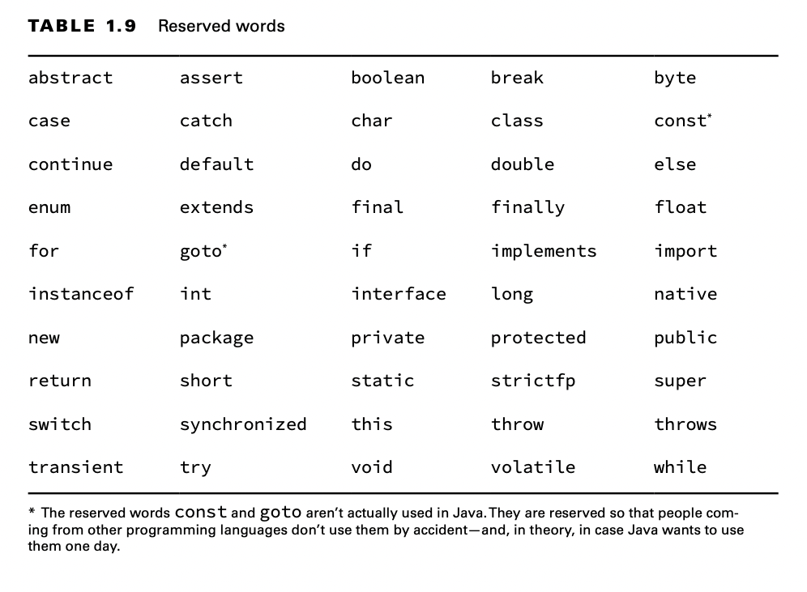

## Declaring Variables

A variable is a name for a piece of memory that stores data. Giving a variable a value is called initializing a
variable.To initialize a variable, you just type the variable name followed by an equal sign, followed by the desired
value.

## Identifying Identifiers

An identifier is the name of a variable, method, class, interface, or package. Luckily, the rules for identifiers for
variables apply to all of the other types that you are free to name.

There are only four rules to remember for legal identifiers:

- Identifiers must begin with a letter, a currency symbol, or a _ symbol. Currency symbols include dollar ($), yuan (¥),
  euro (€), and so on.
- Identifiers can include numbers but not start with them.
- A single underscore _ is not allowed as an identifier.
- You cannot use the same name as a Java reserved word. A reserved word is a special word that Java has held aside so
  that you are not allowed to use it. Remember that Java is case sensitive, so you can use versions of the keywords that
  only differ in case. Please don’t, though.



There are other names that you can’t use. For example, true, false, and null are literal values, so they can’t be
variable names.

```
long okidentifier;
float $OK2Identifier;
boolean _alsoOK1d3ntifi3r; 
char __SStillOkbutKnotsonice$;
```

These examples are not legal:

    int 3DPointClass; // identifiers cannot begin with a number
    byte hollywood@vine; // @ is not a letter, digit, $ or _
    String *$coffee; // * is not a letter, digit, $ or _
    double public; // public is a reserved word
    short _; // a single underscore is not allowed

**camelCase and snake_case**

Although you can do crazy things with identifier names, please don’t. Java has conventions so that code is readable and
consistent. For example, camel case has the first letter of each word capitalized.

Another style is called snake case. It simply uses an underscore (_) to separate words. Java generally uses uppercase
snake case for constants and enum values, such as NUMBER_FLAGS.

## Declaring Multiple Variables

You can also declare and initialize multiple variables in the same statement.
You can declare many variables in the same declaration as long as they are all of the same type.
You can also initialize any or all of those values inline.

```
void sandFence() {
  String s1, s2;
  String s3 = "yes", s4 = "no";
}
```

Three variables were declared: i1, i2, and i3. However, only one of those values was initialized: i3.

```
void paintFence() 
{ 
  int i1, i2, i3 = 0;
}
```

This code doesn’t compile because it tries to declare multiple variables of different types in the same statement.

```
int num, String value; // DOES NOT COMPILE
```

Legal, valid, and compiles are all synonyms in the Java exam world. We try to use all the terminology you could
encounter on the exam.

If you want to declare multiple variables in the same statement, they must share the same type declaration and not
repeat it.