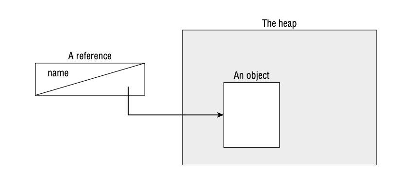

# Destroying Objects

Java provides a garbage collector to automatically look for objects that aren’t needed anymore.

Remember, your code isn’t the only process running in your Java program. Java code exists inside of a JVM, which
includes numerous processes independent from your application code. One of the most important of those is a built-in
garbage collector.

All Java objects are stored in your program memory’s heap. The heap, which is also referred to as the free store,
represents a large pool of unused memory allocated to your Java application.

## Understanding Garbage Collection

Garbage collection refers to the process of automatically freeing memory on the heap by deleting objects that are no
longer reachable in your program.

As a developer, the most interesting part of garbage collection is determining when the memory belonging to an object
can be reclaimed. In Java and other languages, eligible for garbage collection refers to an object’s state of no longer
being accessible in a program and therefore able to be garbage collected.

Does this mean an object that’s eligible for garbage collection will be immediately garbage collected? Definitely not.

Java includes a built-in method to help support garbage collection where you can suggest that garbage collection run.

```
System.gc();
```

Java is free to ignore you. This method is not guaranteed to do anything.

## Tracing Eligibility

The JVM waits patiently and monitors each object until it determines that the code no longer needs that memory. An
object will remain on the heap until it is no longer reachable. An object is no longer reachable when one of two
situations occurs:

- The object no longer has any references pointing to it.
- All references to the object have gone out of scope.

**Objects vs. References**

The reference is a variable that has a name and can be used to access the contents of an object. A reference can be
assigned to another reference, passed to a method, or returned from a method. All references are the same size, no
matter what their type is.

An object sits on the heap and does not have a name.Therefore, you have no way to access an object except through a
reference. Objects come in all different shapes and sizes and consume varying amounts of memory. An object cannot be
assigned to another object, and an object cannot be passed to a method or returned from a method. It is the object that
gets garbage collected, not its reference.



Look at this code and see whether you can figure out when each object first becomes eligible for garbage collection:

    public class Scope {
        public static void main(String[] args) {
            String one, two;
            one = new String("a");
            two = new String("b");
            one = two;
            String three = one;
            one = null;
        }
    }

**Code Formatting on the Exam**

Not all questions will include package declarations and imports. Don’t worry about missing package statements or imports
unless you are asked about them.The following are common cases where you don’t need to check the imports:

- Code that begins with a class name
- Code that begins with a method declaration
- Code that begins with a code snippet that would normally be inside a class or method
- Code that has line numbers that don’t begin with 1

