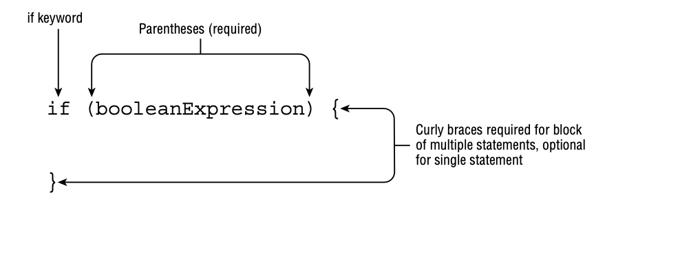
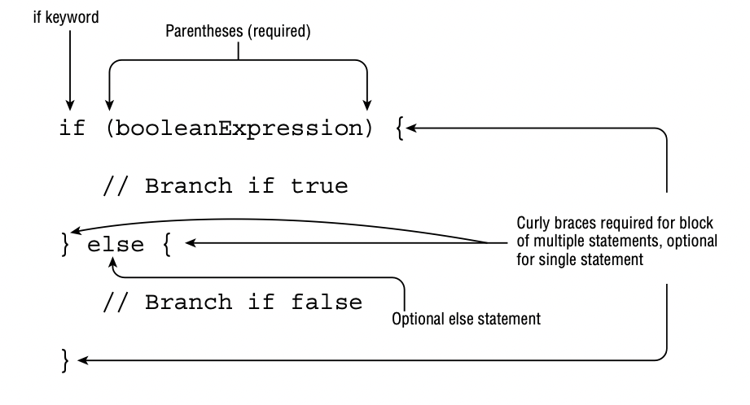

# Creating Decision-Making Statements

## Statements and Blocks

As you may recall from Chapter 1, "Building Blocks," a Java statement is a complete unit of execution in Java,
terminated with a semicolon (;)

Control flow statements break up the flow of execution by using decision-making, looping, and branching, allowing the
application to selectively execute particular segments of code.

These statements can be applied to single expressions as well as a block of Java code.

    // single statement
    patrons++;

    // statement inside a block
    {
        patrons++;
    }

A statement or block often serves as the target of a decision-making statement. For example, we can prepend the
decision-making if statement to these two examples:

    // Single statement
    if (ticketsTaken > 1)
        patrons++;
    // Statement inside a block
    if (ticketsTaken > 1) {
        patrons++;
    }

Again, both of these code snippets are equivalent. Just remember that the target of a decision-making statement can be a
single statement or block of statements.

## The if Statement

Often, we want to execute a block only under certain circumstances. The if statement accomplishes this by allowing our
application to execute a particular block of code if and only if a boolean expression evaluates to true at runtime.

    if(hourOfDay < 11)
        System.out.println("Good Morning");

If the hour of the day is less than 11, then the message will be displayed.

    if(hourOfDay < 11) { 
        System.out.println("Good Morning"); 
        morningGreetingCount++;
    }

**Watch Indentation and Braces**

One area where the exam writers will try to trip you up is if statements without braces ({})

    if(hourOfDay < 11) 
        System.out.println("Good Morning"); 
        morningGreetingCount++;

Based on the indentation, you might be inclined to think the variable morningGreetingCount is only going to be
incremented if hourOfDay is less than 11, but that’s not what this code does. It will execute the print statement only
if the condition is met, but it will always execute the increment operation.

## The else Statement

Let’s return to this example:

    if (hourOfDay < 11) {
        System.out.println("Good Morning");
    } else {
        System.out.println("Good Afternoon");
    }

Similarly, we can append additional if statements to an else block to arrive at a more refined example:

    if (hourOfDay < 11) {
        System.out.println("Good Morning");
    } else if (hourOfDay < 15) {
        System.out.println("Good Afternoon");
    } else {
        System.out.println("Good Evening");
    }

Java process will continue execution until it encounters an if statement that evaluates to true. If neither of the
first two expressions is true, it will execute the final code of the else block.

**Verifying That the if Statement Evaluates to a Boolean Expression**

Another common way the exam may try to lead you astray is by providing code where the boolean expression inside the if
statement is not actually a boolean expression.

    int hourOfDay = 1;
    if(hourOfDay) { // DOES NOT COMPILE
        ... 
    }

This statement may be valid in some other programming and scripting languages, but not in Java, where 0 and 1 are not
considered boolean values.

## Shortening Code with Pattern Matching

Java 16 officially introduced pattern matching with if statements and the instanceof operator. Pattern matching is a
technique of controlling program flow that only executes a section of code that meets certain criteria. It is used in
conjunction with if statements for greater program control.

Pattern matching is a new tool at your disposal to reduce boilerplate in your code.
Boilerplate code is code that tends to be duplicated throughout a section of code over and over again in a similar
manner. A lot of the newer enhancements to the Java language focus on reducing boilerplate.

    void compareIntegersV1(Number number) {
        if (number instanceof Integer) {
            Integer data = (Integer) number;
            System.out.print(data.compareTo(5));
        }
    }

    // Shorter syntax
    void compareIntegersV2(Number number) {
        if (number instanceof Integer data) {
            System.out.print(data.compareTo(5));
        }
    }

The variable "data" in this example is referred to as the pattern variable.
Notice that this code also avoids any potential ClassCastException because the cast operation is executed only if the
implicit instanceof operator returns true.

**Reassigning Pattern Variables**

While possible, it is a bad practice to reassign a pattern variable since doing so can lead to ambiguity about what is
and is not in scope.

    if(number instanceof Integer data) { 
        data = 10;
    }

The reassignment can be prevented with a final modifier, but it is better not to reassign the variable at all.

    if(number instanceof final Integer data) { 
        data = 10; // DOES NOT COMPILE
    }

### Pattern Variables and Expressions

Pattern matching includes expressions that can be used to filter data out, such as in the following example:

    void printIntegersGreaterThan5(Number number) {
        if(number instanceof Integer data && data.compareTo(5)>0)
            System.out.println(data); 
    }

We can apply a number of filters, or patterns, so that the if statement is executed only in specific circumstances.
Notice that we’re using the pattern variable in an expression in the same line in which it is declared.

### Subtypes

The type of the pattern variable must be a subtype of the variable on the left side of the expression. It also cannot be
the same type.

    Integer value = 123;
    if(value instanceof Integer) {}
    if(value instanceof Integer data) {} // DOES NOT COMPILE

While the second line compiles, the last line does not compile because pattern matching requires that the pattern
variable type Integer be a strict subtype of Integer.

    Number value2 = 123;
    if (value2 instanceof Integer data) {

    }

**Limitations of Subtype Enforcement**

The compiler has some limitations on enforcing pattern matching types when we mix classes and interfaces.
For example, given the non-final class Number and interface List, this does compile even though they are unrelated:

    Number value = 123;
    if(value instanceof List) {}
    if(value instanceof List data) {}

### Flow Scoping

The compiler applies flow scoping when working with pattern matching. Flow scoping means the variable is only in scope
when the compiler can definitively determine its type.
Flow scoping is unlike any other type of scoping in that it is not strictly hierarchical like instance, class, or
local scoping. It is determined by the compiler based on the branching and flow of the program.

    void printIntegersOrNumbersGreaterThan5(Number number) { 
        if(number instanceof Integer data || data.compareTo(5)>0) // DOES NOT COMPILE
            System.out.print(data); 
    }

If the input does not inherit Integer, the data variable is undefined. Since the compiler cannot guarantee that data is
an instance of Integer, data is not in scope, and the code does not compile.

What about this example?

    void printIntegerTwice(Number number) {
        if (number instanceof Integer data)
            System.out.print(data.intValue());
        System.out.print(data.intValue()); // DOES NOT COMPILE
    }

Since the input might not have inherited Integer, data is no longer in scope after the if statement.

    void printOnlyIntegers(Number number) {
        if (!(number instanceof Integer data))
            return;
        System.out.print(data.intValue());
    }

It might surprise you to learn this code does compile. Eek! What is going on here? The method returns if the input does
not inherit Integer. This means that when the last line of the method is reached, the input must inherit Integer, and
therefore data stays in scope even after the if statement ends.

**Flow Scoping and else Branches**

If the last code sample confuses you, don’t worry: you’re not alone! Another way to think about it is to rewrite the
logic to something equivalent that uses an else statement:

    void printOnlyIntegers(Number number) { 
        if (!(number instanceof Integer data))
            return; 
        else
            System.out.print(data.intValue()); 
    }

We can now go one step further and reverse the if and else branches by inverting the boolean expression:

    void printOnlyIntegers(Number number) { 
        if (number instanceof Integer data)
            System.out.print(data.intValue());
        else
            return;
    }

In particular, it is possible to use a pattern variable outside of the if statement, but only when the compiler can
definitively determine its type.