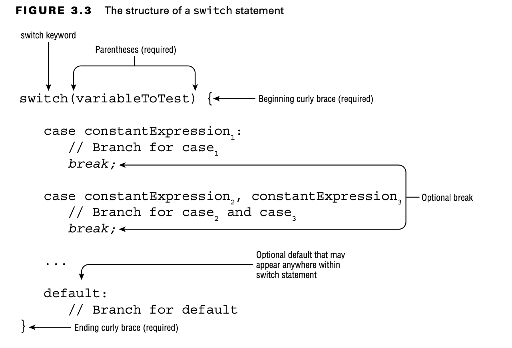
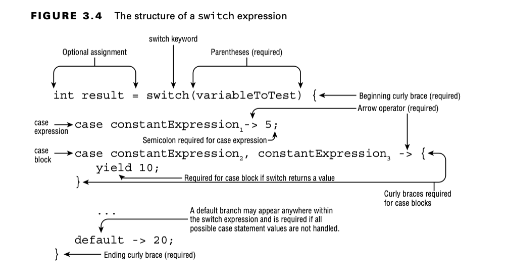

# Applying switch Statements

Difficult to read, and often not fun to maintain:

    public void printDayOfWeekV1(int day) {
        if (day == 0)
            System.out.print("Sunday");
        else if (day == 1)
            System.out.print("Monday");
        else if (day == 2)
            System.out.print("Tuesday");
        else if (day == 3)
            System.out.print("Wednesday");
        // ...
    }

## The switch Statement

A switch statement is a complex decision-making structure in which a single value is evaluated and flow is redirected to
the first matching branch, known as a case statement. If no such case statement is found that matches the value, an
optional default statement will be called. If no such default option is available, the entire switch statement will be
skipped.

**Combining case Values**

Starting with Java 14 , case values can now be combined :

    switch (animal){
        case 1,2: System.out.print("Lion");
        case 3: System.out.print("Tiger");
    }

Prior to Java 14, the equivalent code would have been the following:

    switch(animal) {
        case 1: case 2: System.out.print("Lion"); 
        case 3: System.out.print("Tiger");
    }

See if you can figure out why each of the following switch statements does not compile:

    int month = 5;
    
    switch month { // DOES NOT COMPILE 
        case 1: System.out.print("January");
    }

    switch(month) // DOES NOT COMPILE
        case 1: System.out.print("January");

    switch(month) {
        case 1: 2: System.out.print("January"); // DOES NOT COMPILE
    }

The first switch statement does not compile because it is missing parentheses around the switch variable.
The second statement does not compile because it is missing braces around the switch body.
The third statement does not compile because a comma (,) should be used to separate combined case statements, not a
colon (:).

One last note you should be aware of for the exam: a switch statement is not required to contain any case statements.
For example, this statement is perfectly valid:

    switch(month) {}

### Exiting with break Statements

A break statement terminates the switch statement and returns flow control to the enclosing process. Put simply, it ends
the switch statement immediately.

The break statements are optional, but without them the code will execute every branch following a matching case
statement, including any default statements it finds. Without break statements in each branch, the order of case and
default statements is now extremely important.

What do you think the following prints when printSeason(2) is called?

    public void printSeason(int month) {
        switch (month) {
            case 1, 2, 3:
            case 4, 5, 6:
            default:
            case 7, 8, 9:
            case 10, 11, 12:
        }
    }

It prints everything!

    WinterSpringUnknownSummerFall

It matches the first case statement and executes all of the branches in the order they are found, including the default
statement. It is common, although certainly not required, to use a break statement after every case statement.

The exam creators are fond of switch examples that are missing break statements! When evaluating switch statements on
the exam, always consider that multiple branches may be visited in a single execution.

    public static void printSeasonWithBreak(int month) {
        switch (month) {
            case 1, 2, 3:
                System.out.print("Winter");
                break;
            case 4, 5, 6:
                System.out.print("Spring");
                break;
            default:
                System.out.print("Unknown");
                break;
            case 7, 8, 9:
                System.out.print("Summer");
                break;
            case 10, 11, 12:
                System.out.print("Fall");
                break;
        }
    }

### Selecting switch Data Types

A switch statement has a target variable that is not evaluated until runtime.
The following is a list of all data types supported by switch statements:

- int and Integer
- byte and Byte
- short and Short
- char and Character
- String
- enum values
- var

Notice that boolean, long, float, and double are excluded from switch statements, as are their associated Boolean, Long,
Float, and Double classes.

### Determining Acceptable Case Values

First, the values in each case statement must be compile-time constant values of the same data type as the switch value.
This means you can use only literals, enum constants, or final constant variables of the same data type.
By final constant, we mean that the variable must be marked with the final modifier and initialized with a literal value
in the same expression in which it is declared.

For example, you can’t have a case statement value that requires executing a method at runtime, even if that method
always returns the same value.

    final int getCookies() {
        return 4;
    }

    void feedAnimals() {

        final int bananas = 1;
        int apples = 2;
        int numberOfAnimals = 3;
        final int cookies = getCookies();

        switch (numberOfAnimals) {
            case bananas:
            case apples: // DOES NOT COMPILE
            case getCookies(): // DOES NOT COMPILE
            case cookies: // DOES NOT COMPILE
            case 3 * 5:
        }
    }

The bananas variable is marked final, and its value is known at compile-time, so it is valid. The apples variable is not
marked final, even though its value is known, so it is not permitted. The next two case statements, with values
getCookies() and cookies, do not compile because methods are not evaluated until runtime, so they cannot be used as the
value of a case statement, even if one of the values is stored in a final variable. The last case statement, with value
3 * 5, does compile, as expressions are allowed as case values, provided the value can be resolved at compile-time

## The switch Expression

Our second implementation of printDayOfWeek() was improved but still quite long. Notice that there was a lot of
boilerplate code, along with numerous break statements. Can we do better? Yes, thanks to the new switch expressions that
were officially added to Java 14.

A switch expression is a much more compact form of a switch statement, capable of returning a value.

The switch expression supports two types of branches: an expression and a block.

Like a traditional switch statement, a switch expression supports zero or many case branches and an optional default
branch. Both also support the new feature that allows case values to be combined with a single case statement using
commas. Unlike a traditional switch statement, though, switch expressions have special rules around when the default
branch is required.

    public static void printDayOfWeek(int day) {
        var result = switch (day) {
            case 0 -> "Sunday";
            case 1 -> "Monday";
            case 2 -> "Tuesday";
            case 3 -> "Wednesday";
            case 4 -> "Thursday";
            case 5 -> "Friday";
            case 6 -> "Saturday";
            default -> "Invalid value"; // default branch is required!
        };
        System.out.println(result);
    }

Notice that a semicolon is required after each switch expression.

    var result = switch (bear) { 
        case 30 -> "Grizzly"  // DOES NOT COMPILE 
        default -> "Panda"  // DOES NOT COMPILE 
    } // DOES NOT COMPILE 

    var result = switch (bear) {
        case 30 -> "Grizzly";
        default -> "Panda";
    };

As shown in Figure 3.4, case statements can take multiple values, separated by commas.
Let’s rewrite our printSeason() method from earlier using a switch expression:

    public static void printSeason(int month) {
      switch (month) {
          case 1, 2, 3 -> System.out.print("Winter");
          case 4, 5, 6 -> System.out.print("Spring");
          case 7, 8, 9 -> System.out.print("Summer");
          case 10, 11, 12 -> System.out.print("Fall");
      }

}

Calling printSeason(2) prints the single value Winter. This time we don’t have to worry about break statements, since
only one branch is executed.

All of the previous rules around switch data types and case values still apply, although we have some new rules.

- All of the branches of a switch expression that do not throw an exception must return a consistent data type (if the
  switch expression returns a value).
- If the switch expression returns a value, then every branch that isn’t an expression must yield a value.
- A default branch is required unless all cases are covered or no value is returned.

### Returning Consistent DataTypes

The first rule of using a switch expression is probably the easiest. You can’t return incompatible or random data
types.

    int measurement = 10;
    int size = switch (measurement) {
        case 5 -> 1;
        case 10 -> (short) 2;
        default -> 5;
        case 20 -> "3"; // DOES NOT COMPILE 
        case 40 -> 4L; // DOES NOT COMPILE 
        case 50 -> null; // DOES NOT COMPILE
    };

### Applying a case Block

A switch expression supports both an expression and a block in the case and default branches. Like a regular block, a
case block is one that is surrounded by braces ({}). It also includes a yield statement if the switch expression returns
a value.

    int fish = 5;
    int length = 12;
    var name = switch (fish) {
        case 1 -> "Goldfish";
        case 2 -> {
            yield "Trout";
        }
        case 3 -> {
            if (length > 10) yield "Blobfish";
            else yield "Green";
        }
        default -> "Swordfish";
    };

The yield keyword is equivalent to a return statement within a switch expression and is used to avoid ambiguity about
whether you meant to exit the block or method around the switch expression.

yield statements are not optional if the switch statement returns a value.

Referring to our second rule for switch expressions, yield statements are not optional if the switch statement returns a
value. Can you see why the following lines do not compile?

      int fish = 5;
      int length = 12;
      var name = switch (fish) {
          case 1 -> "Goldfish";
          case 2 -> {} // DOES NOT COMPILE
          case 3 -> {  // DOES NOT COMPILE
              if (length > 10) yield "Blobfish";
          }
          default -> "Swordfish";
      };

      System.out.println(name);

**Watch Semicolons in switch Expressions**

Unlike a regular switch statement, a switch expression can be used with the assignment operator and requires a semicolon
when doing so. Furthermore, semicolons are required for case expressions but cannot be used with case blocks.

    var name = switch (fish) {
        case 1 -> "Goldfish" // DOES NOT COMPILE (missing semicolon)
        case 2 -> {
            yield "Trout";
        }; // DOES NOT COMPILE (extra semicolon)
    } // DOES NOT COMPILE (missing semicolon)

### Covering All Possible Values

The last rule about switch expressions is probably the one the exam is most likely to try to trick you on: a switch
expression that returns a value must handle all possible input values.

    String type = switch (canis) { // DOES NOT COMPILE
        case 1 -> "dog";
        case 2 -> "wolf";
        case 3 -> "coyote";
    };

When adding switch expressions to the Java language, the authors decided this behavior would be unsupported. Every
switch expression must handle all possible values of the switch variable.

- Add a default branch.
- If the switch expression takes an enum value, add a case branch for every possible enum value.

For enums, the second solution works well when the number of enum values is relatively small. For example, consider the
following enum definition and method:

    enum Season {WINTER, SPRING, SUMMER, FALL}  

    String getWeather(Season value) {
      return switch (value) {
        case WINTER -> "Cold";
        case SPRING -> "Rainy";
        case SUMMER -> "Hot";
        case FALL -> "Warm";
      };
    }

Since all possible permutations of Season are covered, a default branch is not required in this switch expression. You
can include an optional default branch, though, even if you cover all known values.

What happens if you use an enum with three values and later someone adds a fourth value? Any switch expressions that use
the enum without a default branch will suddenly fail to compile. If this was done frequently, you might have a lot of
code to fix! For this reason, consider including a default branch in every switch expression, even those that involve
enum values.
