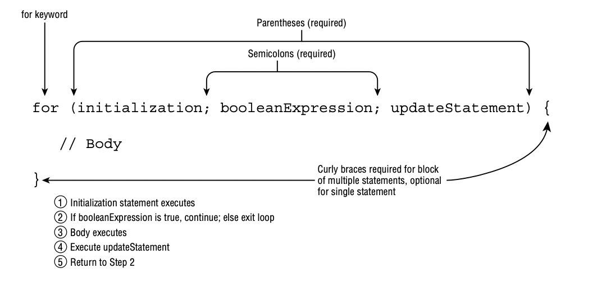
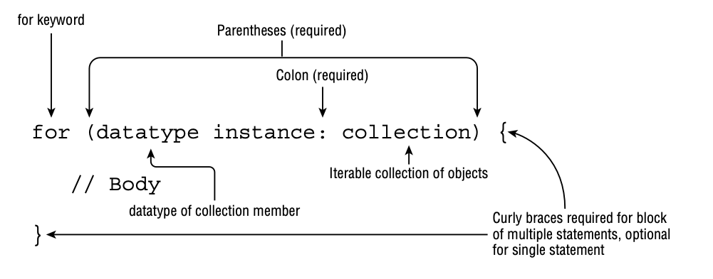

# Constructing for Loops

## The for Loop

A basic for loop has the same conditional boolean expression and statement, or block of statements, as the while loops,
as well as two new sections: an initialization block and an update statement.

    for(int i=0; i < 10; i++) 
        System.out.println("Value is: "+i);
    System.out.println(i); // DOES NOT COMPILE

    int i;
    for(i=0; i < 10; i++)
    System.out.println("Value is: "+i); System.out.println(i);

### Printing Elements in Reverse

    for (var counter = 4; counter >=1 0; counter--) 
    { 
        System.out.print(counter + " ");
    }

For the exam, you are going to have to know how to read forward and backward for loops. When you see a for loop on the
exam, pay close attention to the loop variable and operations if the decrement operator, --, is used

### Working with for Loops

There are a number of variations and edge cases you could see on the exam.

**Creating an Infinite Loop**

    for( ; ; )
        System.out.println("Hello World");

It is actually an infinite loop that will print the same statement repeatedly.

**Adding Multiple Terms to the for Statement**

    int x = 0;
    for(long y = 0, z = 4; x < 5 && y < 10; x++, y++) {
        System.out.print(y + " "); 
    } 
    System.out.print(x + " ");

First, you can declare a variable, such as x in this example, before the loop begins and use it after it completes.
Second, your initialization block, boolean expression, and update statements can include extra variables that may or
may not reference each other.

**Redeclaring a Variable in the Initialization Block**

    int x = 0;
    for(int x = 4; x < 5; x++) // DOES NOT COMPILE
        System.out.print(x + " ");

    int x = 0;
    for(x = 0; x < 5; x++)
        System.out.print(x + " ");

**Using Incompatible Data Types in the Initialization Block**

    int x = 0;
    for(long y = 0, int z = 4; x < 5; x++) // DOES NOT COMPILE
        System.out.print(y + " ");

    The variables in the initialization block must all be of the same type. 

**Using Loop Variables Outside the Loop**

    for(long y = 0, x = 4; x < 5 && y < 10; x++, y++) 
        System.out.print(y + " ");
    System.out.print(x); // DOES NOT COMPILE

Since x was only scoped for the loop, using it outside the loop will cause a compiler error.

### Modifying Loop Variables

As a general rule, it is considered a poor coding practice to modify loop variables due to the unpredictability of the
result, such as in the following examples:

    for(int i=0; i<10; i++) 
        i = 0;

    for(int j=1; j<10; j++) 
        j++;

## The for-each Loop

The for-each loop is a specialized structure designed to iterate over arrays and various Collections Framework classes.

The for-each loop declaration is composed of an initialization section and an object to be iterated over.
The right side of the for-each loop must be one of the following:

- A built-in Java array
- An object whose type implements java.lang.Iterable

The left side of the for-each loop must include a declaration for an instance of a variable whose type is compatible
with the type of the array or collection on the right side of the statement.

    private static void printNamesForEach(String[] names) {
        for (var name : names)
            System.out.println(name);
    }

    private static void printNamesForEach(List<String> names) {
        for (var name : names)
            System.out.println(name);
    }

A for-each loop assigns a variable with the same type as the generic argument.

    String birds = "Jay";
    for(String bird : birds) // DOES NOT COMPILE
        System.out.print(bird + " ");

    String[] sloths = new String[3];
    for(int sloth : sloths) // DOES NOT COMPILE
        System.out.print(sloth + " ");