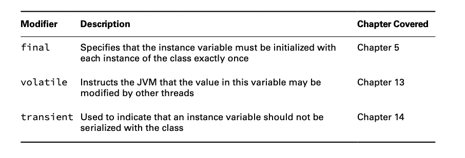

# Declaring Local and Instance Variables

Local variables are those defined with a method or block, while instance variables are those that are defined as a
member of a class.

    public class Lion {
        int hunger = 4;

        public int feedZooAnimals() {
            int snack = 10; // Local variable
            if (snack > 4) {
                long dinnerTime = snack++;
                hunger--;
            }
            return snack;
        }
    }

In the Lion class, snack and dinnertime are local variables only accessible within their respective code blocks, while
hunger is an instance variable and created in every object of the Lion class.

## Local Variable Modifiers

There’s only one modifier that can be applied to a local variable: final.

    public void zooAnimalCheckup(boolean isWeekend) {
        final int rest;
        if (isWeekend) rest = 5;
        else rest = 20;
        System.out.print(rest);

        final var giraffe = new Animal();
        final int[] friends = new int[5];

        rest = 10; // DOES NOT COMPILE
        giraffe = new Animal(); // DOES NOT COMPILE
        friends = null; // DOES NOT COMPILE
    }

    public void zooAnimalCheckup2(boolean isWeekend) {
        final int rest;
        if(isWeekend) rest = 5;
        // System.out.print(rest); // DOES NOT COMPILE
    }

The rest variable might not have been assigned a value, such as if isWeekend is false. Since the compiler does not allow
the use of local variables that may not have been assigned a value, the code does not compile.

Does using the final modifier mean we can’t modify the data? Nope. The final attribute only refers to the variable
reference; the contents can be freely modified.

    public void zooAnimalCheckup() {
        final int rest = 5;
        final Animal giraffe = new Animal();
        final int[] friends = new int[5];
        giraffe.setName("George");
        friends[2] = 2;
    }

While it might not seem obvious, marking a local variable final is often a good practice. For example, you may have a
complex method in which a variable is referenced dozens of times. It would be really bad if someone came in and
reassigned the variable in the middle of the method. Using the final attribute is like sending a message to other
developers to leave the variable alone!

## Effectively Final Variables

An effectively final local variable is one that is not modified after it is assigned. This means that the value of a
variable doesn’t change after it is set, regardless of whether it is explicitly marked as final. If you aren’t sure
whether a local variable is effectively final, just add the final keyword. If the code still compiles, the variable is
effectively final.

In this example, name and wet are effectively final and can be updated with the final modifier, but not size.

    public String zooFriends() {
        String name = "Harry the Hippo";
        var size = 10;
        boolean wet;
        if (size > 100) size++;
        name.substring(0);
        wet = true;
        return name;
    }

**Effectively Final Parameters**

Recall from Chapter 1 that method and constructor parameters are local variables that have been pre-initialized. In the
context of local variables, the same rules around final and effectively final apply.This is especially important in
Chapter 7 and Chapter 8, “Lambdas and Functional Interfaces,” since local classes and lambda expressions declared within
a method can only reference local variables that are final or effectively final.

## Instance Variable Modifiers

Like methods, instance variables can use access modifiers, such as private, package, protected, and public. Remember,
package access is indicated by the lack of any modifiers. We cover each of the different access modifiers shortly in
this chapter. Instance variables can also use optional specifiers.

If an instance variable is marked final, then it must be assigned a value when it is declared or when the object is
instantiated. Like a local final variable, it cannot be assigned a value more than once, though.

The compiler does not apply a default value to final variables, though. A final instance or final static variable must
receive a value when it is declared or as part of initialization.

    public class PolarBear {
        final int age = 10;
        final int fishEaten;
        final String name;
    
        {
            fishEaten = 10;
        }
    
        public PolarBear() {
            name = "Robert";
        }
    }
