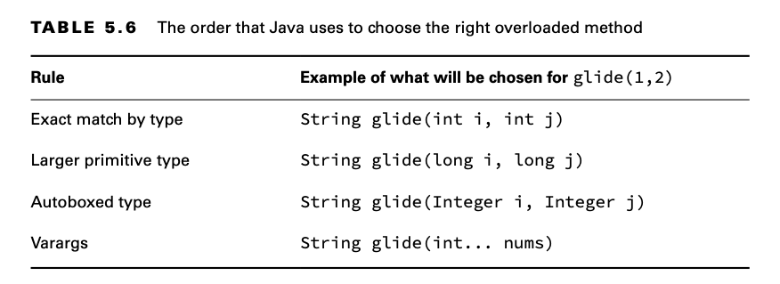

# Overloading Methods

Method overloading occurs when methods in the same class have the same name but different method signatures, which means
they use different parameter lists.

Everything other than the method name can vary for overloading methods. This means there can be different access
modifiers, optional specifiers (like static), return types, and exception lists.

    public class Falcon {

        public void fly(int numMiles) {}
        public void fly(short numFeet) {}
        public boolean fly() { return false; }
        void fly(int numMiles, short numFeet) {}
        public void fly(short numFeet, int numMiles) throws Exception {}
    }

As you can see, we can overload by changing anything in the parameter list. We can have a different type, more types, or
the same types in a different order. Also notice that the return type, access modifier, and exception list are
irrelevant to overloading. Only the method name and parameter list matter.

    public class Eagle {
        public void fly(int numMiles) {}
        public int fly(int numMiles) { return 1; } // DOES NOT COMPILE
    }

This method doesn’t compile because it differs from the original only by return type. The method signatures are the
same, so they are duplicate methods as far as Java is concerned.

    public class Hawk {
        public void fly(int numMiles) {
        }
    
        public static void fly(int numMiles) {
        } // DOES NOT COMPILE
    
        public void fly(int numKilometers) {
        } // DOES NOT COMPILE
    }

Again, the method signatures of these three methods are the same. You cannot declare methods in the same class where the
only difference is that one is an instance method and one is a static method. You also cannot have two methods that have
parameter lists with the same variable types and in the same order. As we mentioned earlier, the names of the parameters
in the list do not matter when determining the method signature.

## Reference Types

Given the rule about Java picking the most specific version of a method that it can, what do you think this code
outputs?

    public class Pelican {

        public void fly(String s) {
            System.out.print("string");
        }
    
        public void fly(Object o) {
            System.out.print("object");
        }
    
        public static void main(String[] args) {
            var p = new Pelican();
            p.fly("test");
            System.out.print("-");
            p.fly(56);
        }
    }

The answer is string-object. The first call passes a String and finds a direct match. There’s no reason to use the
Object version when there is a nice String parameter list just waiting to be called. The second call looks for an int
parameter list. When it doesn’t find one, it autoboxes to Integer. Since it still doesn’t find a match, it goes to the
Object one.

    public class Parrot {

        public static void print(List<Integer> i) {
            System.out.print("I");
        }
    
        public static void print(CharSequence c) {
            System.out.print("C");
        }
    
        public static void print(Object o) {
            System.out.print("O");
        }
    
        public static void main(String[] args) {
            print("abc");
            print(Arrays.asList(3));
            print(LocalDate.of(2019, Month.JULY, 4));
        }
    }

## Primitives

Primitives work in a way that’s similar to reference variables. Java tries to find the most specific matching overloaded
method.

    public class Ostrich {

        public void fly(int i) {
            System.out.print("int");
        }
    
        public void fly(long l) {
            System.out.print("long");
        }
    
    
        public static void main(String[] args) {
            var p = new Ostrich();
            p.fly(123);
            System.out.print("-");
            p.fly(123L);
        }
    }

The answer is int-long. The first call passes an int and sees an exact match. The second call passes a long and also
sees an exact match. If we comment out the overloaded method with the int parameter list, the output becomes long-long.
Java has no problem calling a larger primitive. However, it will not do so unless a better match is not found.

## Autoboxing

    public class Kiwi {
    
        public void fly(int numMiles) {}

        public void fly(Integer numMiles) {}

    }

These method overloads are valid. Java tries to use the most specific parameter list it can find. This is true for
autoboxing as well as other matching types we talk about in this section.
This means calling fly(3) will call the first method. When the primitive int version isn’t present, Java will autobox.
However, when the primitive int version is provided, there is no reason for Java to do the extra work of autoboxing.

## Arrays

Unlike the previous example, this code does not autobox:

    public static void walk(int[] ints) {}
    public static void walk(Integer[] integers) {}

## Varargs

Which method do you think is called if we pass an int[]?

    public class Toucan {
      public void fly(int[] lengths) {}
      public void fly(int... lengths) {} // DOES NOT COMPILE
    }

Trick question! Remember that Java treats varargs as if they were an array. This means the method signature is the same
for both methods. Since we are not allowed to overload methods with the same parameter list, this code doesn’t compile.
Even though the code doesn’t look the same, it compiles to the same parameter list.

## Putting It All Together

Java calls
the most specific method it can. When some of the types interact, the Java rules focus on backward compatibility. A long
time ago, autoboxing and varargs didn’t exist. Since old code still needs to work, this means autoboxing and varargs
come last when Java looks at overloaded methods.

    public class Glider {

        public static String glide(String s) {
            return "1";
        }
    
        public static String glide(String... s) {
            return "2";
        }
    
        public static String glide(Object o) {
            return "3";
        }
    
        public static String glide(String s, String t) {
            return "4";
        }
    
        public static void main(String[] args) {
    
            System.out.print(glide("a"));
            System.out.print(glide("a", "b"));
            System.out.print(glide("a", "b", "c"));
    
        }
    }

It prints out 142. The first call matches the signature taking a single String because that is the most specific match.
The second call matches the signature taking two String parameters since that is an exact match. It isn’t until the
third call that the varargs version is used since there are no better matches.