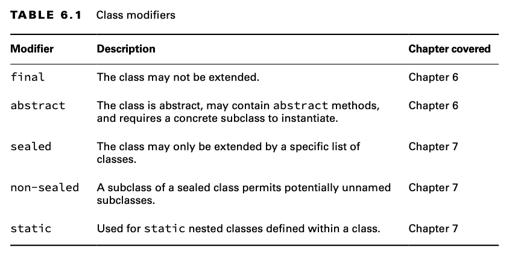
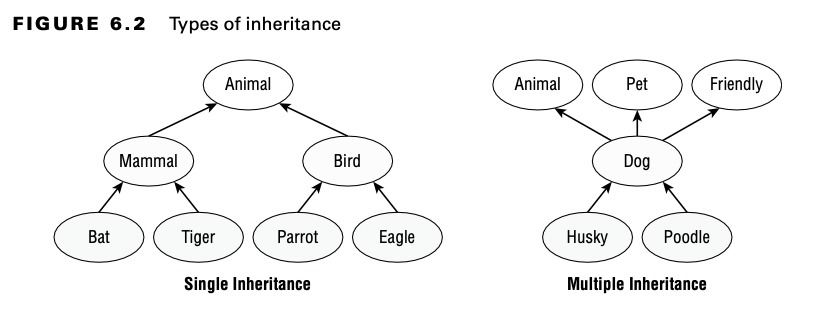

# Understanding Inheritance

Inheritance is the process by which a subclass automatically includes certain members of the class, including
primitives, objects, or methods, defined in the parent class.

## Declaring a Subclass

Let’s begin with the declaration of a class and its subclass.

We indicate a class is a subclass by declaring it with the extends keyword. We don’t need to declare anything in the
superclass other than making sure it is not marked final.

One key aspect of inheritance is that it is transitive. Given three classes [X, Y, Z], if X extends Y, and Y extends Z,
then X is considered a subclass or descendant of Z.

When one class inherits from a parent class, all public and protected members are automatically available as part of the
child class. If the two classes are in the same package, then package members are available to the child class. Last but
not least, private members are restricted to the class they are defined in and are never available via inheritance.

## Class Modifiers

Like methods and variables, a class declaration can have various modifiers.

The final modifier prevents a class from being extended any further.

    public final class Rhinoceros extends Mammal { }
    public class Clara extends Rhinoceros { } // DOES NOT COMPILE

## Single vs. Multiple Inheritance

Java supports single inheritance, by which a class may inherit from only one direct parent class. Java also supports
multiple levels of inheritance, by which one class may extend another class, which in turn extends another class. You
can have any number of levels of inheritance, allowing each descendant to gain access to its ancestor’s members.

By design, Java doesn’t support multiple inheritance in the language because multiple inheritance can lead to complex,
often difficult-to-maintain data models.

Java does allow one exception to the single inheritance rule, which you see in Chapter 7—a class may implement multiple
interfaces.

## Inheriting Object

In Java, all classes inherit from a single class: java.lang.Object, or Object for short. Furthermore, Object is the only
class that doesn’t have a parent class.

The compiler has been automatically inserting code into any class you write that doesn’t extend a specific class.

    public class Zoo { }
    public class Zoo extends java.lang.Object { }

Primitive types such as int and boolean do not inherit from Object, since they are not classes.