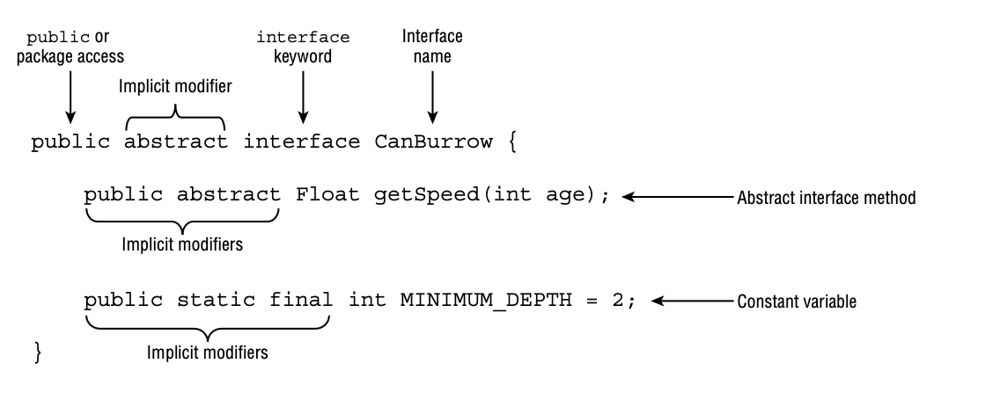

# Implementing Interfaces

An interface is an abstract data type that declares a list of abstract methods that any class implementing the interface
must provide.

Over time, the precise definition of an interface has changed, as new method types are now supported.

## Declaring and Using an Interface

In Java, an interface is defined with the interface keyword, analogous to the class keyword used when defining a class.

Our interface declaration includes an abstract method and a constant variable. Interface variables are referred to as
constants because they are assumed to be public, static, and final. They are initialized with a constant value when they
are declared.

One aspect of an interface declaration that differs from an abstract class is that it contains implicit modifiers. An
implicit modifier is a modifier that the compiler automatically inserts into the code.
For example, an interface is always considered to be abstract, even if it is not marked so.

    public abstract interface WalksOnTwoLegs {}

    var e = new WalksOnTwoLegs(); // DOES NOT COMPILE

    public final interface WalksOnEightLegs {} // DOES NOT COMPILE

## Extending an Interface

Like a class, an interface can extend another interface using the extends keyword.

    public interface Nocturnal {}

    public interface HasBigEyes extends Nocturnal {}

Unlike a class, which can extend only one class, an interface can extend multiple interfaces.

    public interface Nocturnal {
        public int hunt();
    }

    public interface CanFly {
        public void flap();
    }

    public interface HasBigEyes extends Nocturnal, CanFly {}

    public class Owl implements HasBigEyes {
        public int hunt() { return 5; }
        public void flap() { System.out.println("Flap!"); }
    }

Extending two interfaces is permitted because interfaces are not initialized as part of a class hierarchy. Unlike
abstract classes, they do not contain constructors and are not part of instance initialization. Interfaces simply define
a set of rules and methods that a class implementing them must follow.

## Inheriting an Interface

Like an abstract class, when a concrete class inherits an interface, all of the inherited abstract methods must be
implemented.

The concrete Swan class inherits four abstract methods that it must imple- ment: getType(), canSwoop(), fly(), and
swim().

### Mixing Class and Interface Keywords

The exam creators are fond of questions that mix class and interface terminology. Although a class can implement an
interface, a class cannot extend an interface. Likewise, while an interface can extend another interface, an interface
cannot implement another interface.

    public interface CanRun {}
    public class Cheetah extends CanRun {} // DOES NOT COMPILE

    public class Hyena {}
    public interface HasFur extends Hyena {} // DOES NOT COMPILE

### Inheriting Duplicate Abstract Methods

Java supports inheriting two abstract methods that have compatible method declarations.

    public interface Herbivore { public void eatPlants(); }

    public interface Omnivore { public void eatPlants(); }

    public class Bear implements Herbivore, Omnivore {
        public void eatPlants() { 
            System.out.println("Eating plants");
        }
    }

The following is an example of an incompatible declaration:

    public interface Herbivore { public void eatPlants(); }
    
    public interface Omnivore { public int eatPlants(); }

    public class Tiger implements Herbivore, Omnivore { // DOES NOT COMPILE.. 
    ..
    }

It’s impossible to write a version of Tiger that satisfies both inherited abstract methods. The code does not compile,
regardless of what is declared inside the Tiger class.

### Inserting Implicit Modifiers

An implicit modifier is one that the compiler will automatically insert.

The following list includes the implicit modifiers for interfaces that you need to know for the exam:

- Interfaces are implicitly abstract.
- Interface variables are implicitly public, static, and final.
- Interface methods without a body are implicitly abstract.
- Interface methods without the private modifier are implicitly public.

The following two interface definitions are equivalent, as the compiler will convert them both to the second
declaration:

    public interface Soar {

        int MAX_HEIGHT = 10;
        final static boolean UNDERWATER = true;
    
        void fly(int speed);
    
        abstract void takeoff();
    
        public abstract double dive();
    
    }

    public abstract interface Soar {
        public static final int MAX_HEIGHT = 10;
        public final static boolean UNDERWATER = true;
    
        public abstract void fly(int speed);
    
        public abstract void takeoff();
    
        public abstract double dive();
    }

### Conflicting Modifiers

What happens if a developer marks a method or variable with a modifier that conflicts with an implicit modifier? For
example, if an abstract method is implicitly public, can it be explicitly marked protected or private?

    public interface Dance {
        private int count = 4; // DOES NOT COMPILE 
        protected void step(); // DOES NOT COMPILE
    }

### Differences between Interfaces and Abstract Classes

Even though abstract classes and interfaces are both considered abstract types, only inter- faces make use of implicit
modifiers.

    abstract class Husky { // abstract required in class declaration
        abstract void play(); // abstract required in method declaration
    }

    interface Poodle { // abstract optional in interface declaration
        void play(); // abstract optional in method declaration
    }

The Husky class will not compile if the play() method is not marked abstract, whereas the method in the Poodle interface
will compile with or without the abstract modifier.

What about the access level of the play() method?

    public class Webby extends Husky {
        void play() {} // OK - play() is declared with package access in Husky
    }
    
    public class Georgette implements Poodle {
        void play() {} // DOES NOT COMPILE - play() is public in Poodle
    }

the method in the Georgette class reduces the access modifier on the method from public to package access.
