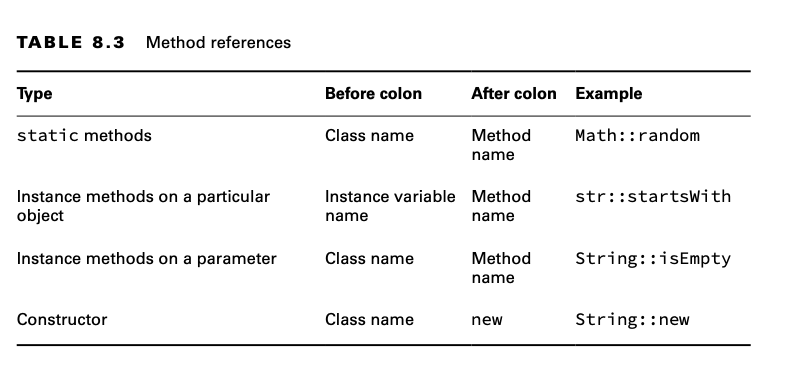

# Using Method References

Method references are another way to make the code easier to read, such as simply mentioning the name of the method.

    public interface LearnToSpeak {
        void speak(String sound);
    }

    public class DuckHelper {
        public static void teacher(String name, LearnToSpeak trainer) {
            trainer.speak(name);
        }
    }

This code implements the functional interface using a lambda:

    public class Duckling {
        public static void makeSound(String sound) {
            LearnToSpeak learner = s -> System.out.println(s);
            DuckHelper.teacher(sound, learner);
        }
    }

The lambda declares one parameter named s. However, it does nothing other than pass that parameter to another method. A
method reference lets us remove that redundancy and instead write this:

    LearnToSpeak learner = System.out::println;

The :: operator tells Java to call the println() method later.
Remember that :: is like a lambda, and it is used for deferred execution with a functional interface.

There are four formats for method references:

- static methods
- Instance methods on a particular object
- Instance methods on a parameter to be determined at runtime
- Constructors

## Calling static Methods

we use a functional interface that converts a double to a long:

    public interface Converter{
        long round(double num);
    }

We can implement this interface with the round() method in Math. Here we assign a method reference and a lambda to this
functional interface:

    Converter methodRef = Math::round;
    Converter lambda = x -> Math.round(x);

    System.out.println(methodRef.round(101.1));
    System.out.println(lambda.round(101.1));

## Calling Instance Methods on a Particular Object

For this example, our functional interface checks if a String starts with a specified value:

    interface StringStart {
        boolean beginningCheck(String prefix);
    }

Conveniently, the String class has a startsWith() method that takes one parameter and returns a boolean. Let’s look at
how to use method references with this code:

    var str = "Zoo";
    StringStart methodRef = str::startsWith;
    StringStart lambda = s -> str.startsWith(s);

    System.out.println(methodRef.beginningCheck("A"));
    System.out.println(lambda.beginningCheck("A"));

A method reference doesn’t have to take any parameters. In this example, we create a functional interface with a method
that doesn’t take any parameters but returns a value:

    interface StringChecker { 
        boolean check();
    }

    var str2 = "";
    StringChecker methodRef2 = str2::isEmpty;
    StringChecker lambda2 = () -> str2.isEmpty();

    System.out.println(methodRef2.check());
    System.out.println(lambda2.check());

Since the method on String is an instance method, we call the method reference on an instance of the String class.

While all method references can be turned into lambdas, the opposite is not always true. For example, consider this
code:

    var str = "";
    StringChecker lambda = () -> str.startsWith("Zoo");

    StringChecker methodReference = str::startsWith; // DOES NOT COMPILE
    StringChecker methodReference = str::startsWith("Zoo"); // DOES NOT COMPILE

Neither of these works! While we can pass the str as part of the method reference, there’s no way to pass the "Zoo"
parameter with it. Therefore, it is not possible to write this lambda as a method reference.

## Calling Instance Methods on a Parameter

This time, we are going to call the same instance method that doesn’t take any parameters.

    interface StringParameterChecker { 
        boolean check(String text);
    }

    StringParameterChecker methodRef = String::isEmpty;
    StringParameterChecker lambda = s -> s.isEmpty();

    System.out.println(methodRef.check("Zoo"));
    System.out.println(lambda.check("Zoo"));

Java knows that isEmpty() is an instance method that does not take any parameters. Java uses the parameter supplied at
runtime as the instance on which the method is called.

You can even combine the two types of instance method references. Again, we need a new functional interface that takes
two parameters:

    public interface StringTwoParameterChecker {
        boolean check(String text, String prefix);
    }

    StringTwoParameterChecker methodRef2 = String::startsWith;
    StringTwoParameterChecker lambda2 = (s, p) -> s.startsWith(p);

    System.out.println(methodRef2.check("Zoo", "Z"));
    System.out.println(lambda2.check("Zoo", "A"));

## Calling Constructors

A constructor reference is a special type of method reference that uses new instead of a method and instantiates an
object.

    interface EmptyStringCreator { 
        String create();
    }

    EmptyStringCreator methodRef = String::new;
    EmptyStringCreator lambda = () -> new String();

    var myString = methodRef.create();
    System.out.println(myString.equals("Snake")); // false

It expands like the method references you have seen so far. In the previous example, the lambda doesn’t have any
parameters.

Method references can be tricky. This time we create a functional interface that takes one parameter and returns a
result:

    interface StringCopier { 
        String copy(String value);
    }

    StringCopier methodRef2 = String::new;
    StringCopier lambda2 = x -> new String(x);

    var myString2 = methodRef2.copy("Zebra");
    System.out.println(myString2.equals("Zebra")); // true

This means you can’t always determine which method can be called by looking at the method reference. Instead, you have
to look at the context to see what parameters are used and if there is a return type. In this example, Java sees that we
are passing a String parameter and calls the constructor of String that takes such a parameter.

## Reviewing Method References

