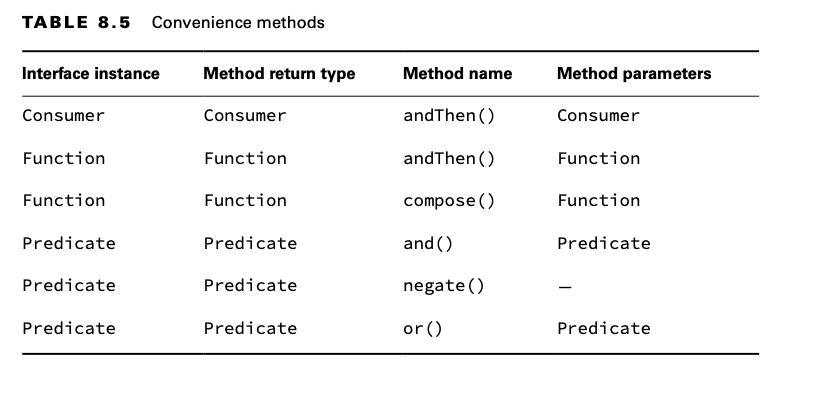
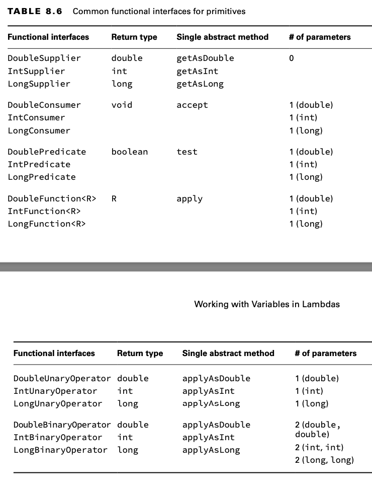

# Working with Built-in Functional Interfaces

The core functional interfaces are provided in the java.util.function package.

We cover generics in the next chapter, but for now, you just need to know that <T> allows the interface to take an
object of a specified type. If a second type parameter is needed, we use the next letter, U. If a distinct return type
is needed, we choose R for return as the generic type.

## Implementing Supplier

A Supplier is used when you want to generate or supply values without taking any input. The Supplier interface is
defined as follows:

    @FunctionalInterface
    public interface Supplier<T> {
        T get();
    }

    Supplier<LocalDate> s1 = LocalDate::now; 
    Supplier<LocalDate> s2 = () -> LocalDate.now();

    LocalDate d1 = s1.get(); 
    LocalDate d2 = s2.get();

A Supplier is often used when constructing new objects.

    Supplier<StringBuilder> s1 = StringBuilder::new;
    Supplier<StringBuilder> s2 = () -> new StringBuilder();

    System.out.println(s1.get());
    System.out.println(s2.get());

This time, we used a constructor reference to create the object.

    Supplier<ArrayList<String>> s3 = ArrayList::new;
    ArrayList<String> a1 = s3.get();
    System.out.println(a1); // []

Notice how we called get() on the functional interface. What would happen if we tried to print out s3 itself?

    System.out.println(s3);
    
    chapter08.workingwithbuiltinfunctionalinterfaces.ImplementingSupplier$$Lambda$20/0x0000000800c03440@5caf905d

Then comes $$, which means that the class doesn’t exist in a class file on the file system. It exists only in memory.

## Implementing Consumer and BiConsumer

You use a Consumer when you want to do something with a parameter but not return anything. BiConsumer does the same
thing, except that it takes two parameters. The interfaces are defined as follows:

    @FunctionalInterface
    public interface Consumer<T>{
        void accept(T t);   
        //omitted default method
    }

    @FunctionalInterface
    public interfaec BiConsumer<T,U> {
        void accept(T t, U u);
        //omitted default method
    }

Printing is a common use of the Consumer interface:

    Consumer<String> c1 = System.out::println;
    Consumer<String> c2 = x -> System.out.println(x);

    c1.accept("Annie");
    c2.accept("Annie");

BiConsumer is called with two parameters. They don’t have to be the same type.

    var map = new HashMap<String, Integer>();

    BiConsumer<String, Integer> b1 = map::put;
    BiConsumer<String, Integer> b2 = (k, v) -> map.put(k, v);

    b1.accept("chicken", 7);
    b2.accept("chick", 1);

    System.out.println(map);

As another example, we use the same type for both generic parameters:

    var map = new HashMap<String, String>();

    BiConsumer<String, String> b1 = map::put;
    BiConsumer<String, String> b2 = (k, v) -> map.put(k, v);

    b1.accept("chicken", "Cluck");
    b2.accept("chick", "Tweep");

    System.out.println(map);

## Implementing Predicate and BiPredicate

Predicate is often used when filtering or matching. Both are common operations. A BiPredicate is just like a Predicate,
except that it takes two parameters instead of one. The interfaces are defined as follows:

    @FunctionalInterface
    public interface Predicate<T> {
        boolean test(T t);
        // omitted default and static methods
    }

    @FunctionalInterface
    public interface BiPredicate<T,U> {
        boolean test(T t, U u);
        // omitted default methods
    }

You can use a Predicate to test a condition.

    Predicate<String> p1 = String::isEmpty;
    Predicate<String> p2 = x -> x.isEmpty();

    System.out.println(p1.test("")); // true
    System.out.println(p2.test("")); // true

    BiPredicate<String, String> b1 = String::startsWith;
    BiPredicate<String, String> b2 = (string, prefix) -> string.startsWith(prefix);

    System.out.println(b1.test("chicken", "chick")); // true
    System.out.println(b2.test("chicken", "chick")); // true

## Implementing Function and BiFunction

A Function is responsible for turning one parameter into a value of a potentially different type and returning it.
Similarly, a BiFunction is responsible for turning two parameters into a value and returning it. The interfaces are
defined as follows:

    @FunctionalInterface
    public interface Function<T,R> {
        R apply(T t);
        // omitted default and static methods
    }

    @FunctionalInterface
    public interface BiFunction<T, U, R> {
        R apply(T t, U u);
        // omitted default method 
    }

For example, this function converts a String to the length of the String:

    Function<String, Integer> f1 = String::length;
    Function<String, Integer> f2 = x -> x.length();

    System.out.println(f1.apply("cluck"));
    System.out.println(f2.apply("cluck"));

The following combines two String objects and produces another String:

    BiFunction<String, String, String> b1 = String::concat;
    BiFunction<String, String, String> b2 = (string, toAdd) -> string.concat(toAdd);

    System.out.println(b1.apply("baby ", "chick")); // baby chick
    System.out.println(b2.apply("baby ", "chick")); // baby chick

## Implementing UnaryOperator and BinaryOperator

UnaryOperator and BinaryOperator are special cases of a Function. They require all type parameters to be the same type.

    @FunctionalInterface
    public interface UnaryOperator<T> extends Function<T, T> {
        // omitted static method 
    }

    @FunctionalInterface
    public interface BinaryOperator<T> extends BiFunction<T, T, T> {
        // omitted static methods 
    }

This means the method signatures look like this:

    T apply(T t); // UnaryOperator
    T apply(T t1, T t2); // BinaryOperator

You’ll notice that these methods are inherited from the Function/BiFunction superclass.

    UnaryOperator<String> u1 = String::toUpperCase;
    UnaryOperator<String> u2 = x -> x.toUpperCase();

    System.out.println(u1.apply("chirp")); // CHIRP 
    System.out.println(u2.apply("chirp")); // CHIRP

And now here’s the binary example:

    BinaryOperator<String> b1 = String::concat;
    BinaryOperator<String> b2 = (string, toAdd) -> string.concat(toAdd);
    System.out.println(b1.apply("baby ", "chick")); // baby chick
    System.out.println(b2.apply("baby ", "chick")); // baby chick

## Checking Functional Interfaces

It’s really important to know the number of parameters, types, return value, and method name for each of the functional
interfaces.

What functional interface would you use in these three situations?

- Returns a String without taking any parameters
- Returns a Boolean and takes a String
- Returns an Integer and takes two Integers

The first one is a Supplier<String> because it generates an object and takes zero parameters. The second one is a
Function<String,Boolean> because it takes one parameter and returns another type. It’s a little tricky. You might think
it is a Predicate<String>. Note that a Predicate returns a boolean primitive and not a Boolean object.

Finally, the third one is either a BinaryOperator<Integer> or a BiFunction<Integer,Integer,Integer>. Since
BinaryOperator is a special case of BiFunction, either is a correct answer. BinaryOperator<Integer> is the better answer
of the two since it is more specific.

    Predicate<List> ex1 = x -> "".equals(x.get(0));
    Consumer<Long> ex2 = (Long l) -> System.out.println(l);
    BiPredicate<String,String> ex3 = (s1,s2) -> false;

    Function<List<String>> ex4 = x -> x.get(0); // DOES NOT COMPILE
    UnaryOperator<Long> ex5 = (Long l) -> 3.14; // DOES NOT COMPILE

## Using Convenience Methods on Functional Interfaces

By definition, all functional interfaces have a single abstract method. This doesn’t mean they can have only one method,
though. Several of the common functional interfaces provide a number of helpful default interface methods.

Let’s start with these two Predicate variables:

    Predicate<String> egg = s -> s.contains("egg");
    Predicate<String> brown = s -> s.contains("brown");

Now we want a Predicate for brown eggs and another for all other colors of eggs.
We could write this by hand, as shown here:

    Predicate<String> brownEggs = s -> s.contains("egg") && s.contains("brown"); 
    Predicate<String> otherEggs = s -> s.contains("egg") && !s.contains("brown");

This works, but it’s not great. It’s a bit long to read, and it contains duplication.

    Predicate<String> brownEggs = egg.and(brown); 
    Predicate<String> otherEggs = egg.and(brown.negate());

Moving on to Consumer, let’s take a look at the andThen() method, which runs two functional interfaces in sequence:

    Consumer<String> c1 = x -> System.out.print("1: " + x); 
    Consumer<String> c2 = x -> System.out.print(",2: " + x);
    Consumer<String> combined = c1.andThen(c2); 
    combined.accept("Annie"); // 1: Annie,2: Annie

Notice how the same parameter is passed to both c1 and c2. This shows that the Consumer instances are run in sequence
and are independent of each other.

    Function<Integer, Integer> before = x -> x + 1; 
    Function<Integer, Integer> after = x -> x * 2;
    Function<Integer, Integer> combined = after.compose(before); 
    System.out.println(combined.apply(3)); // 8

## Learning the Functional Interfaces for Primitives

There are also a large number of special functional interfaces for primitives. These are useful in Chapter 10 when we
cover streams and optionals.

Most of them are for the double, int, and long types. There is one exception, which is BooleanSupplier.

### Functional Interfaces for boolean

    @FunctionalInterface
    public interface BooleanSupplier {
        boolean getAsBoolean(); 
    }

    BooleanSupplier b1 = () -> true;
    BooleanSupplier b2 = () -> Math.random() > .5;

    System.out.println(b1.getAsBoolean());
    System.out.println(b2.getAsBoolean());

### Functional Interfaces for double, int, and long

Most of the functional interfaces are for double, int, and long.

Generics are gone from some of the interfaces, and instead the type name tells us what primitive type is involved. In
other cases, such as IntFunction, only the return type generic is needed because we’re converting a primitive int into
an object.

The single abstract method is often renamed when a primitive type is returned.

    var d = 1.0
    DoubleToIntFunction f1 = x ->1;
    f1.applyAsInt(d);