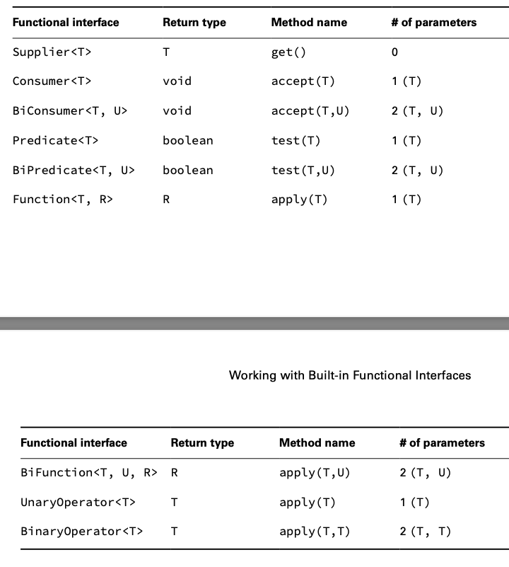

# Working with Built-in Functional Interfaces

The core functional interfaces are provided in the java.util.function package.

We cover generics in the next chapter, but for now, you just need to know that <T> allows the interface to take an
object of a specified type. If a second type parameter is needed, we use the next letter, U. If a distinct return type
is needed, we choose R for return as the generic type.

## Implementing Supplier

A Supplier is used when you want to generate or supply values without taking any input. The Supplier interface is
defined as follows:

    @FunctionalInterface
    public interface Supplier<T> {
        T get();
    }

    Supplier<LocalDate> s1 = LocalDate::now; 
    Supplier<LocalDate> s2 = () -> LocalDate.now();

    LocalDate d1 = s1.get(); 
    LocalDate d2 = s2.get();

A Supplier is often used when constructing new objects.

    Supplier<StringBuilder> s1 = StringBuilder::new;
    Supplier<StringBuilder> s2 = () -> new StringBuilder();

    System.out.println(s1.get());
    System.out.println(s2.get());

This time, we used a constructor reference to create the object.

    Supplier<ArrayList<String>> s3 = ArrayList::new;
    ArrayList<String> a1 = s3.get();
    System.out.println(a1); // []

Notice how we called get() on the functional interface. What would happen if we tried to print out s3 itself?

    System.out.println(s3);
    
    chapter08.workingwithbuiltinfunctionalinterfaces.ImplementingSupplier$$Lambda$20/0x0000000800c03440@5caf905d

Then comes $$, which means that the class doesn’t exist in a class file on the file system. It exists only in memory.

## Implementing Consumer and BiConsumer

You use a Consumer when you want to do something with a parameter but not return anything. BiConsumer does the same
thing, except that it takes two parameters. The interfaces are defined as follows:

    @FunctionalInterface
    public interface Consumer<T>{
        void accept(T t);   
        //omitted default method
    }

    @FunctionalInterface
    public interfaec BiConsumer<T,U> {
        void accept(T t, U u);
        //omitted default method
    }

Printing is a common use of the Consumer interface:

    Consumer<String> c1 = System.out::println;
    Consumer<String> c2 = x -> System.out.println(x);

    c1.accept("Annie");
    c2.accept("Annie");

BiConsumer is called with two parameters. They don’t have to be the same type.

    var map = new HashMap<String, Integer>();

    BiConsumer<String, Integer> b1 = map::put;
    BiConsumer<String, Integer> b2 = (k, v) -> map.put(k, v);

    b1.accept("chicken", 7);
    b2.accept("chick", 1);

    System.out.println(map);

As another example, we use the same type for both generic parameters:

    var map = new HashMap<String, String>();

    BiConsumer<String, String> b1 = map::put;
    BiConsumer<String, String> b2 = (k, v) -> map.put(k, v);

    b1.accept("chicken", "Cluck");
    b2.accept("chick", "Tweep");

    System.out.println(map);

## Implementing Predicate and BiPredicate

Predicate is often used when filtering or matching. Both are common operations. A BiPredicate is just like a Predicate,
except that it takes two parameters instead of one. The interfaces are defined as follows:

    @FunctionalInterface
    public interface Predicate<T> {
        boolean test(T t);
        // omitted default and static methods
    }

    @FunctionalInterface
    public interface BiPredicate<T,U> {
        boolean test(T t, U u);
        // omitted default methods
    }

You can use a Predicate to test a condition.

    Predicate<String> p1 = String::isEmpty;
    Predicate<String> p2 = x -> x.isEmpty();

    System.out.println(p1.test("")); // true
    System.out.println(p2.test("")); // true

    BiPredicate<String, String> b1 = String::startsWith;
    BiPredicate<String, String> b2 = (string, prefix) -> string.startsWith(prefix);

    System.out.println(b1.test("chicken", "chick")); // true
    System.out.println(b2.test("chicken", "chick")); // true

## Implementing Function and BiFunction

A Function is responsible for turning one parameter into a value of a potentially different type and returning it.
Similarly, a BiFunction is responsible for turning two parameters into a value and returning it. The interfaces are
defined as follows:

    @FunctionalInterface
    public interface Function<T,R> {
        R apply(T t);
        // omitted default and static methods
    }

    @FunctionalInterface
    public interface BiFunction<T, U, R> {
        R apply(T t, U u);
        // omitted default method 
    }

For example, this function converts a String to the length of the String:

    Function<String, Integer> f1 = String::length;
    Function<String, Integer> f2 = x -> x.length();

    System.out.println(f1.apply("cluck"));
    System.out.println(f2.apply("cluck"));

The following combines two String objects and produces another String:

    BiFunction<String, String, String> b1 = String::concat;
    BiFunction<String, String, String> b2 = (string, toAdd) -> string.concat(toAdd);

    System.out.println(b1.apply("baby ", "chick")); // baby chick
    System.out.println(b2.apply("baby ", "chick")); // baby chick