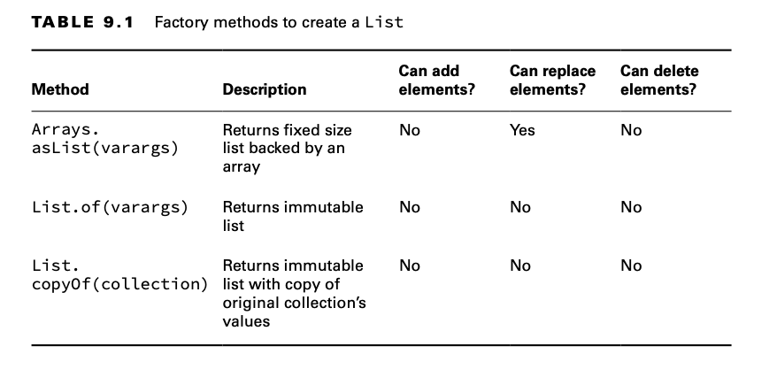
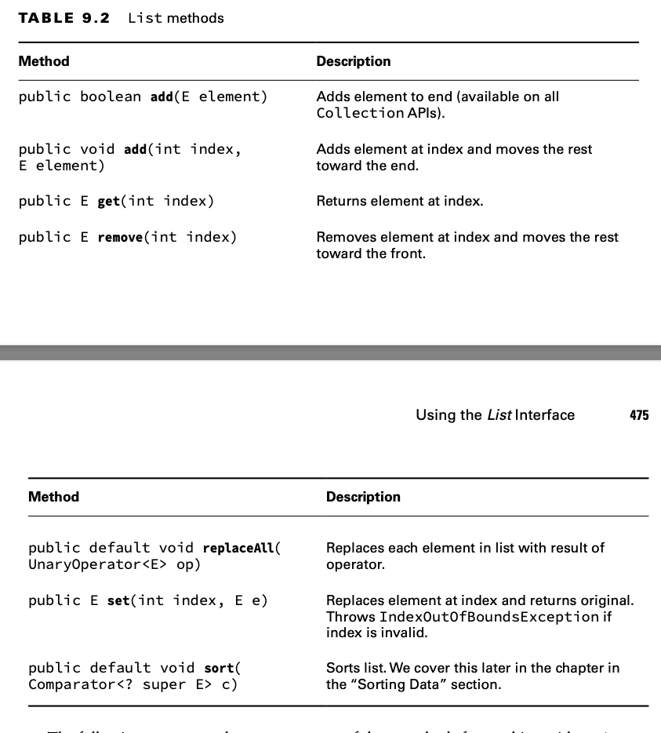

# Using the List Interface

You use a list when you want an ordered collection that can contain duplicate entries. For example, a list of names may
contain duplicates, as two animals can have the same name. Items can be retrieved and inserted at specific positions in
the list based on an int index, much like an array. Unlike an array, though, many List implementations can change in
size after they are declared.

The main thing all List implementations have in common is that they are ordered and allow duplicates. Beyond that, they
each offer different functionality. We look at the implementations that you need to know and the available methods.

Pay special attention to which names are classes and which are interfaces. The exam may ask you which is the best
class or which is the best interface for a scenario.

## Comparing List Implementations

An ArrayList is like a resizable array. When elements are added, the ArrayList automatically grows. When you aren’t sure
which collection to use, use an ArrayList.

The main benefit of an ArrayList is that you can look up any element in constant time. Adding or removing an element is
slower than accessing an element. This makes an ArrayList a good choice when you are reading more often than (or the
same amount as) writing to the ArrayList

A LinkedList is special because it implements both List and Deque. It has all the methods of a List. It also has
additional methods to facilitate adding or removing from the beginning and/or end of the list.

The main benefits of a LinkedList are that you can access, add to, and remove from the beginning and end of the list in
constant time. The trade-off is that dealing with an arbitrary index takes linear time. This makes a LinkedList a good
choice when you’ll be using it
as Deque.

## Creating a List with a Factory

When you create a List of type ArrayList or LinkedList, you know the type. There are a few special methods where you get
a List back but don’t know the type. These methods let you create a List including data in one line using a factory
method. This is convenient, especially when testing. Some of these methods return an immutable object.

Let’s take a look at an example of these three methods:

    String[] array = new String[]{"a", "b", "c"};
    List<String> asList = Arrays.asList(array);
    List<String> of = List.of(array);
    List<String> copy = List.copyOf(asList);
    array[0] = "z";

    System.out.println(asList);     // [z, b, c]
    System.out.println(of);         // [a, b, c]
    System.out.println(copy);       // [a, b, c]

    asList.set(0, "x");
    System.out.println(Arrays.toString(array));  // [x, b, c]

    copy.add("y"); // UnsupportedOperationException

## Creating a List with a Constructor

Most Collections have two constructors that you need to know for the exam. The following shows them for LinkedList:

    var linked1 = new LinkedList<String>();
    var linked2 = new LinkedList<String>(linked1);

ArrayList has an extra constructor you need to know. We now show the three constructors:

    var list1 = new ArrayList<String>();
    var list2 = new ArrayList<String>(list1); 
    var list3 = new ArrayList<String>(10);

The first two are the common constructors you need to know for all Collections. The final example says to create an
ArrayList containing a specific number of slots, but again not to assign any. You can think of this as the size of the
underlying array.

**Using var with ArrayList**

Consider this code, which mixes var and generics:

    var strings = new ArrayList<String>(); 
    strings.add("a");
    for (String s: strings) { }

The type of var is ArrayList<String>.This means you can add a String or loop through the String objects. What if we use
the diamond operator with var?

    var list = new ArrayList<>();

Believe it or not, this does compile.The type of the var is ArrayList<Object>. Since there isn’t a type specified for
the generic, Java has to assume the ultimate superclass.This is a bit silly and unexpected, so please don’t write it.

    var list = new ArrayList<>();
    list.add("a");
    for (String s: list) { } // DOES NOT COMPILE

## Working with List Methods

The methods in the List interface are for working with indexes.

The following statements demonstrate most of these methods for working with a List:

    List<String> list = new ArrayList<>();
    list.add("SD");                             // [SD]
    list.add(0, "NY");                          // [NY,SD]
    list.set(1, "FL");                          // [NY,FL]
    System.out.println(list.get(0));            // NY
    list.remove("NY");                          // [FL]
    list.remove(0);                             // []
    list.set(0, "?");                           // IndexOutOfBoundsException

Now let’s take a look at the replaceAll() method. It uses a UnaryOperator that takes one parameter and returns a value
of the same type:

    var numbers = Arrays.asList(1, 2, 3);
    numbers.replaceAll(x -> x * 2);
    System.out.println(numbers); // [2, 4, 6]

**Overloaded remove() Methods**

We’ve now seen two overloaded remove() methods.The one from Collection removes an object that matches the parameter. By
contrast, the one from List removes an element at a specified index.

    var list = new LinkedList<Integer>();
    list.add(3);    // [3]
    list.add(2);    // [3,2]    
    list.add(1);    // [3,2,1]
    list.remove(2); // [3,2]
    list.remove(Integer.valueOf(2)); //[3]
    System.out.println(list);

Since calling remove() with an int uses the index, an index that doesn’t exist will throw an exception. For example,
list.remove(100) throws an IndexOutOfBoundsException.

## Converting from List to an Array

Let’s start with turning a List into an array:

    List<String> list = new ArrayList<>();
    list.add("hawk");
    list.add("robin");
    Object[] objectArray = list.toArray();
    String[] stringArray = list.toArray(new String[0]);
    list.clear();
    System.out.println(objectArray.length); // 2
    System.out.println(stringArray.length); // 2

The array is a newly created object with no relationship to the original List. It is simply a copy.
