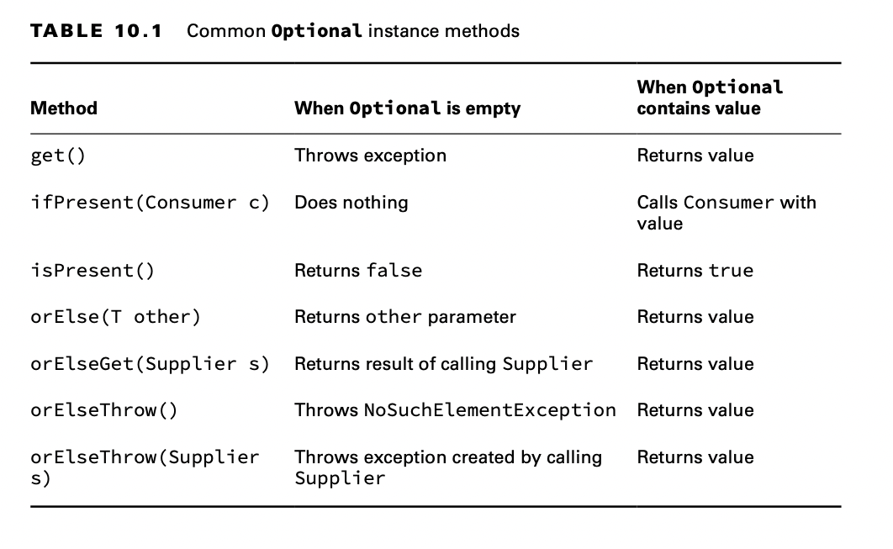

# Returning an Optional

An Optional is created using a factory. You can either request an empty Optional or pass a value for the Optional to
wrap.

## Creating an optional

Here’s how to code our average method:

    public static Optional<Double> average(int... scores) {
        if (scores.length == 0) return Optional.empty();
        int sum = 0;
        for (int score : scores) sum += score;
        return Optional.of((double) sum / scores.length);
    }

Calling the method shows what is in our two boxes:

    System.out.println(average(90, 100)); // Optional[95.0] 
    System.out.println(average()); // Optional.empty

You can see that one Optional contains a value and the other is empty. Normally, we want to check whether a value is
there and/or get it out of the box. Here’s one way to do that:

    Optional<Double> opt = average(90, 100); 
    if (opt.isPresent())
        System.out.println(opt.get()); // 95.0

First we check whether the Optional contains a value. Then we print it out. What if we didn’t do the check, and the
Optional was empty?

    Optional<Double> opt = average();
    System.out.println(opt.get()); // NoSuchElementException

When creating an Optional, it is common to want to use empty() when the value is null. You can do this with an if
statement or ternary operator.

    Optional o = (value == null) ? Optional.empty() : Optional.of(value);

If value is null, o is assigned the empty Optional. Otherwise, we wrap the value. Since
this is such a common pattern, Java provides a factory method to do the same thing.

    Optional o = Optional.ofNullable(value);

You’ve already seen get() and isPresent(). The other methods allow you to write code that uses an Optional in one line
without having to use the ternary operator. This makes the code easier to read.

    Optional<Double> opt = average(90, 100); 
    opt.ifPresent(System.out::println);

## Dealing with an Empty Optional

The remaining methods allow you to specify what to do if a value isn’t present. There are a few choices. The first two
allow you to specify a return value either directly or using a Supplier.

    Optional<Double> opt = average();
    System.out.println(opt.orElse(Double.NaN));
    System.out.println(opt.orElseGet(() -> Math.random()));

Alternatively, we can have the code throw an exception if the Optional is empty.

    Optional<Double> opt2 = average();
    System.out.println(opt2.orElseThrow());

Without specifying a Supplier for the exception, Java will throw a NoSuchElementException. Alternatively, we can have
the code throw a custom exception if the Optional is empty. Remember that the stack trace looks weird because the
lambdas are generated rather than named classes.

    Optional<Double> opt = average();
    System.out.println(opt.orElseThrow(() -> new IllegalStateException()));

Notice that we do not write throw new IllegalStateException(). The orElseThrow() method takes care of actually throwing
the exception when we run it.

The two methods that take a Supplier have different names. Do you see why this code does not compile?

    System.out.println(opt.orElseGet(
    () -> new IllegalStateException())); // DOES NOT COMPILE

The opt variable is an Optional<Double>. This means the Supplier must return a Double. Since this Supplier returns an
exception, the type does not match.

    Optional<Double> opt = average(90, 100);
    System.out.println(opt.orElse(Double.NaN));
    System.out.println(opt.orElseGet(() -> Math.random()));
    System.out.println(opt.orElseThrow());

**Is Optional the Same as null?**

An alternative to Optional is to return null.There are a few shortcomings with this approach. One is that there isn’t a
clear way to express that null might be a special value. By contrast, returning an Optional is a clear statement in the
API that there might not be a value.

Another advantage of Optional is that you can use a functional programming style with ifPresent() and the other methods
rather than needing an if statement. Finally, you see toward the end of the chapter that you can chain Optional calls.