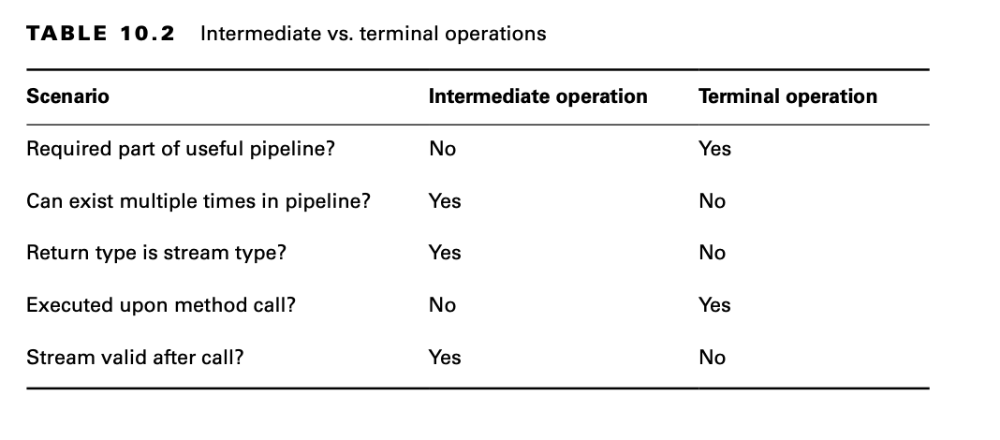
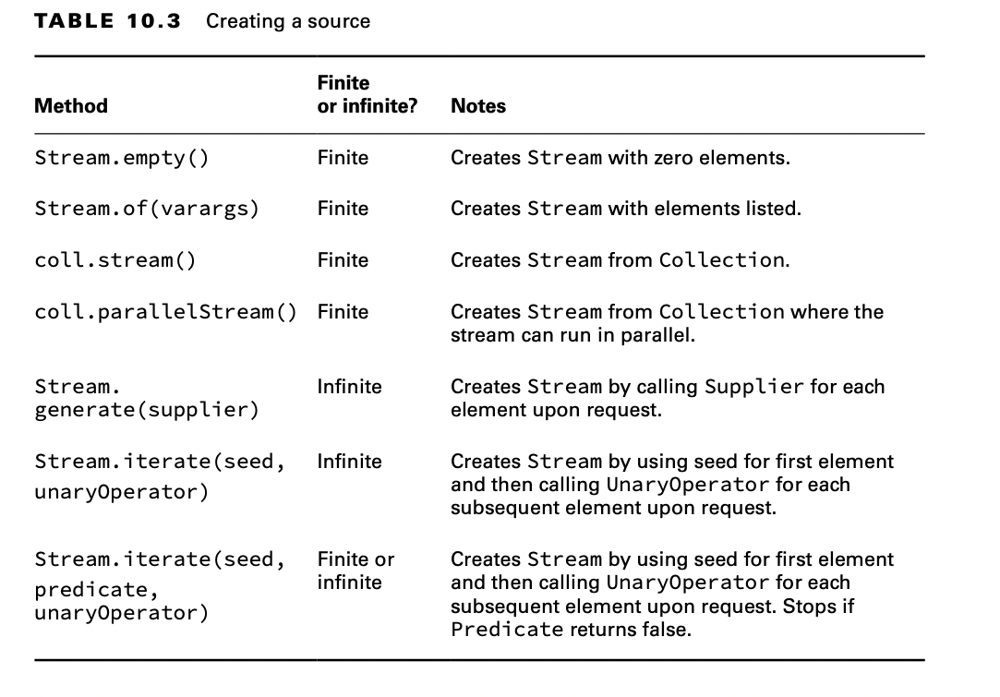
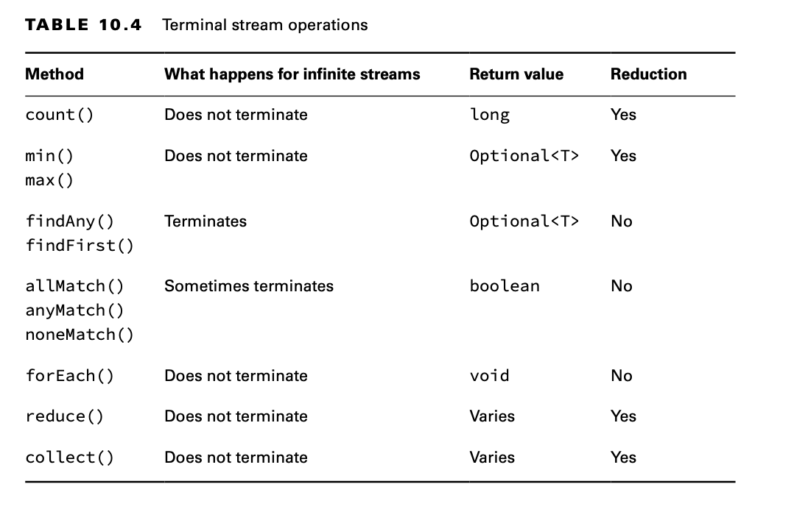

# Using Streams

A stream in Java is a sequence of data. A stream pipeline consists of the operations that run on a stream to produce a
result.

## Understanding the Pipeline Flow

Many things can happen in the assembly line stations along the way. In functional programming, these are called stream
operations.There are three parts to a stream pipeline ;

- Source : Where the stream comes from.
- Intermediate operations : Transforms the stream into another one. There can be as few or as many intermediate
  operations as you’d like. Since streams use lazy evaluation, the intermediate operations do not run until the terminal
  operation runs.
- Terminal operation : Produces a result. Since streams can be used only once, the stream is no longer valid after a
  terminal operation completes.

You will need to know the differences between intermediate and terminal operations well.

## Creating Stream Sources

In Java, the streams we have been talking about are represented by the Stream<T> interface, defined in the
java.util.stream package.

### Creating Finite Streams

There are a few ways to create them.

    Stream<String> empty = Stream.empty();          // count = 0 
    Stream<Integer> singleElement = Stream.of(1);   // count = 1 
    Stream<Integer> fromArray = Stream.of(1, 2, 3); // count = 3

Java also provides a convenient way of converting a Collection to a stream.

    var list = List.of("a", "b", "c");
    Stream<String> fromList = list.stream();

**Creating a Parallel Stream**

It is just as easy to create a parallel stream from a list.

    var list = List.of("a", "b", "c");
    Stream<String> fromListParallel = list.parallelStream();

This is a great feature because you can write code that uses concurrency before even learning what a thread is. Using
parallel streams is like setting up multiple tables of workers who can do the same task. Painting would be a lot faster
if we could have five painters painting signs instead of just one. Just keep in mind some tasks cannot be done in
parallel, such as putting the signs away in the order that they were created in the stream. Also be aware that there is
a cost in coordinating the work, so for smaller streams, it might be faster to do it sequentially.

## Creating Infinite Streams

We can’t create an infinite list, though, which makes streams more powerful.

    Stream<Double> randoms = Stream.generate(Math::random);
    Stream<Integer> oddNumbers = Stream.iterate(1, n -> n + 2);

**Printing a Stream Reference**

If you try to call System.out.print(stream), you’ll get something like the following:

    java.util.stream.ReferencePipeline$Head@4617c264

What if you wanted just odd numbers less than 100? There’s an overloaded version of iterate() that helps:

    Stream<Integer> oddNumberUnder100 = Stream.iterate(
      1, // seed
      n -> n < 100, // Predicate to specify when done
      n -> n + 2); // UnaryOperator to get next value

### Reviewing Stream Creation Methods

## Using CommonTerminal Operations

You can perform a terminal operation without any intermediate operations but not the other way around.

Reductions are a special type of terminal operation where all of the contents of the stream are combined into a single
primitive or Object.

### Counting

The count() method determines the number of elements in a finite stream. For an infinite stream, it never terminates.
Why? Count from 1 to infinity, and let us know when you are finished.

    public long count()

The count() method is a reduction because it looks at each element in the stream and returns a single value.

    Stream<String> s = Stream.of("monkey", "gorilla", "bonobo");
    System.out.println(s.count()); // 3

### Finding the Minimum and Maximum

The min() and max() methods allow you to pass a custom comparator and find the smallest or largest value in a finite
stream according to that sort order.

Like the count() method,min() and max() hang on an infinite stream because they cannot be sure that a smaller or larger
value isn’t coming later in the stream.

Both methods are reductions because they return a single value after looking at the entire stream.

    public Optional<T> min(Comparator<? super T> comparator) 
    public Optional<T> max(Comparator<? super T> comparator)

This example finds the animal with the fewest letters in its name:

    Stream<String> s = Stream.of("monkey", "ape", "bonobo");
    Optional<String> min = s.min((s1, s2) -> s1.length() - s2.length());
    min.ifPresent(System.out::println); // ape

Notice that the code returns an Optional rather than the value. This allows the method to specify that no minimum or
maximum was found.

Let’s look at an empty stream:

    Optional<?> minEmpty = Stream.empty().min((s1, s2) -> 0); 
    System.out.println(minEmpty.isPresent()); // false

Since the stream is empty, the comparator is never called, and no value is present in the Optional.

What if you need both the min() and max() values of the same stream? For now, you can’t have both, at least not using
these methods. Remember, a stream can have only one terminal operation. Once a terminal operation has been run, the
stream cannot be used again. As you see later in this chapter, there are built-in summary methods for some numeric
streams that will calculate a set of values for you.

### Finding a Value

The findAny() and findFirst() methods return an element of the stream unless the stream is empty. If the stream is
empty, they return an empty Optional.

This is the first method you’ve seen that can terminate with an infinite stream.

As its name implies, the findAny() method can return any element of the stream.
When called on the streams you’ve seen up until now, it commonly returns the first element, although this behavior is
not guaranteed. The findAny() method is more likely to return a random element when working with parallel streams.

These methods are terminal operations but not reductions. The reason is that they sometimes return without processing
all of the elements. This means that they return a value based on the stream but do not reduce the entire stream into
one value.

The method signatures are as follows:

    public Optional<T> findAny() 
    public Optional<T> findFirst()

This example finds an animal:

    Stream<String> s = Stream.of("monkey", "gorilla", "bonobo");
    Stream<String> infinite = Stream.generate(() -> "chimp");

    s.findAny().ifPresent(System.out::println); // monkey (usually)
    infinite.findAny().ifPresent(System.out::println); // chimp