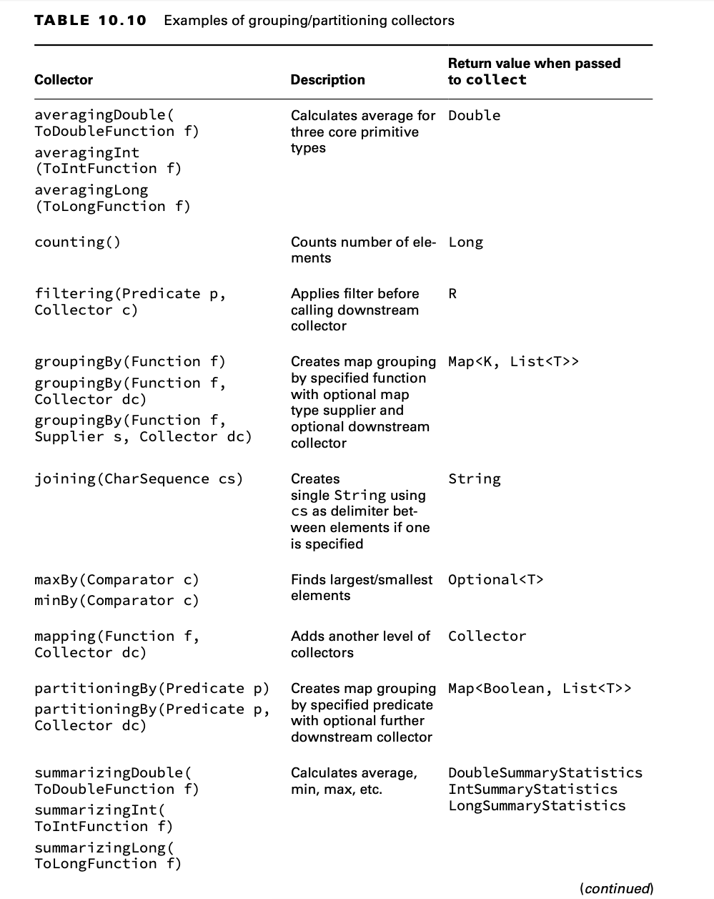
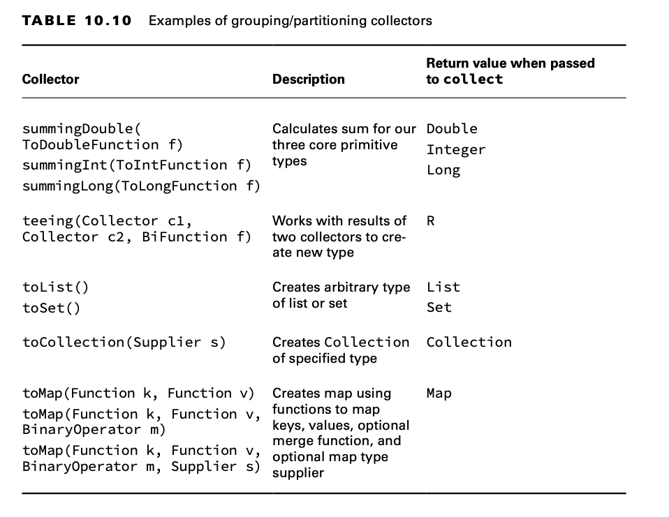

# Working with Advanced Stream Pipeline Concepts

## Linking Streams to the Underlying Data

What do you think this outputs?

    var cats = new ArrayList<String>();
    cats.add("Annie");
    cats.add("Ripley");

    var stream = cats.stream();
    cats.add("KC");
    System.out.println(stream.count());

The correct answer is 3. Remember that streams are lazily evaluated.

## Chaining Optionals

A few of the intermediate operations for streams are available for Optional.

    private static void threeDigit(Optional<Integer> optional) {
        if (optional.isPresent()) { // outer if
            var num = optional.get();
            var string = "" + num;
            if (string.length() == 3) // inner if
                System.out.println(string);
        }
    }

It works, but it contains nested if statements. That’s extra complexity. Let’s try this again with functional
programming:

    private static void threeDigitV2(Optional<Integer> optional) {
        optional.map(n -> "" + n) // part 1
                .filter(s -> s.length() == 3) // part 2 
                .ifPresent(System.out::println); // part 3
    }

Now suppose that we wanted to get an Optional<Integer> representing the length of the String contained in another
Optional. Easy enough:

    Optional<Integer> result = optional.map(String::length);

**Checked Exceptions and Functional Interfaces**

You might have noticed by now that most functional interfaces do not declare checked exceptions.This is normally okay.
However, it is a problem when working with methods that declare checked exceptions. Suppose that we have a class with a
method that throws a checked exception:

    public class ExceptionCaseStudy {
        private static List<String> create() throws IOException {
            throw new IOException();
        }
    
        public void good() throws IOException {
            ExceptionCaseStudy.create().stream().count();
        }
    
        public void bad() throws IOException {
            Supplier<List<String>> s = ExceptionCaseStudy::create; // DOES NOT COMPILE
        }
    }

Say what now?The problem is that the lambda to which this method reference expands does not declare an exception.The
Supplier interface does not allow checked exceptions. There are two approaches to get around this problem. One is to
catch the exception and turn it into an unchecked exception.

       public void ugly() {
            Supplier<List<String>> s = () -> {
                try {
                    return ExceptionCaseStudy.create();
                } catch (IOException e) {
                    throw new RuntimeException(e);
                }
            };
        }

This works. But the code is ugly. One of the benefits of functional programming is that the code is supposed to be easy
to read and concise. Another alternative is to create a wrapper method with try/catch.

    private static List<String> createSafe() {
        try {
            return ExceptionCaseStudy.create();
        } catch (IOException e) {
            throw new RuntimeException(e);
        }
    }

    public void wrapped() {
        Supplier<List<String>> s2 = ExceptionCaseStudy::createSafe;
    }

## Using a Spliterator

The characteristics of a Spliterator depend on the underlying data source. A Collection data source is a basic
Spliterator. By contrast, when using a Stream data source, the Spliterator can be parallel or even infinite. The Stream
itself is executed lazily rather than when the Spliterator is created.

You do need to know how to work with some of the common methods declared on this interface.

    var stream = List.of("bird-", "bunny-", "cat-", "dog-", "fish-", "lamb-", "mouse-");

    Spliterator<String> originalBagOfFood = stream.spliterator();
    Spliterator<String> emmasBag = originalBagOfFood.trySplit();
    emmasBag.forEachRemaining(System.out::print); // bird-bunny-cat-

    Spliterator<String> jillsBag = originalBagOfFood.trySplit();
    jillsBag.tryAdvance(System.out::print); // dog-
    jillsBag.forEachRemaining(System.out::print); // fish-
    originalBagOfFood.forEachRemaining(System.out::print); // lamb-mouse-

Now let’s try an example with a Stream. This is a complicated way to print out 123:

    var originalBag = Stream.iterate(1, n -> ++n).spliterator();

    Spliterator<Integer> newBag = originalBag.trySplit();
    newBag.tryAdvance(System.out::print); // 1
    newBag.tryAdvance(System.out::print); // 2
    newBag.tryAdvance(System.out::print); // 3

You might have noticed that this is an infinite stream. No problem! The Spliterator recognizes that the stream is
infinite and doesn’t attempt to give you half. Instead, newBag contains a large number of elements. We get the first
three since we call tryAdvance() three times. It would be a bad idea to call forEachRemaining() on an infinite stream!
Note that a Spliterator can have a number of characteristics such as CONCURRENT, ORDERED, SIZED, and SORTED. You will
only see a straightforward Spliterator on the exam. For example, our infinite stream was not SIZED.

## Collecting Results

### Using Basic Collectors

Luckily, many of these collectors work the same way. Let’s look at an example:

    var ohMy = Stream.of("lions", "tigers", "bears");
    String result = ohMy.collect(Collectors.joining(", "));
    System.out.println(result); // lions, tigers, bears

Let’s try another one. What is the average length of the three animal names?

    var ohMy = Stream.of("lions", "tigers", "bears");
    Double result = ohMy.collect(Collectors.averagingInt(String::length));
    System.out.println(result); // 5.333333333333333

Often, you’ll find yourself interacting with code that was written without streams. This means that it will expect a
Collection type rather than a Stream type. No problem. You can still express yourself using a Stream and then convert to
a Collection at the end.

    var ohMy = Stream.of("lions", "tigers", "bears");
    TreeSet<String> result = ohMy
            .filter(s -> s.startsWith("t"))
            .collect(Collectors.toCollection(TreeSet::new));
    System.out.println(result); // [tigers]

### Collecting into Maps

Let’s start with a straightforward example to create a map from a stream:

    var ohMy = Stream.of("lions", "tigers", "bears");
    Map<String, Integer> map = ohMy.collect(
            Collectors.toMap(s -> s, String::length));
    System.out.println(map); // {lions=5, bears=5, tigers=6}

Returning the same value passed into a lambda is a common operation, so Java provides a method for it. You can rewrite
s -> s as Function.identity(). It is not shorter and may or may not be clearer, so use your judgment about whether to
use it.

Now we want to do the reverse and map the length of the animal name to the name itself. Our first incorrect attempt is
shown here:

    var ohMy = Stream.of("lions", "tigers", "bears");
    Map<Integer, String> map = ohMy.collect(Collectors.toMap(
            String::length, 
            k -> k)); // BAD

Running this gives an exception similar to the following:

    Exception in thread "main" java.lang.IllegalStateException: Duplicate key 5 (attempted merging values lions and bears)

What’s wrong? Two of the animal names are the same length. We didn’t tell Java what to do. Should the collector choose
the first one it encounters? The last one it encounters? Concatenate the two? Since the collector has no idea what to
do, it “solves” the problem by throwing an exception and making it our problem.

    var ohMy = Stream.of("lions", "tigers", "bears");
    Map<Integer, String> map = ohMy.collect(Collectors.toMap(
            String::length,
            k -> k,
            (s1, s2) -> s1 + "," + s2));
    System.out.println(map); // {5=lions,bears, 6=tigers}
    System.out.println(map.getClass()); // class java.util.HashMap

It so happens that the Map returned is a HashMap. This behavior is not guaranteed. Suppose that we want to mandate
that the code return a TreeMap instead. No problem. We would just add a constructor reference as a parameter:

    var ohMy = Stream.of("lions", "tigers", "bears");
    TreeMap<Integer, String> map = ohMy.collect(Collectors.toMap(
            String::length,
            k -> k,
            (s1, s2) -> s1 + "," + s2, TreeMap::new));
    System.out.println(map); // // {5=lions,bears, 6=tigers}
    System.out.println(map.getClass()); // class java.util.TreeMap

### Grouping, Partitioning, and Mapping

The exam creators like asking about groupingBy() and partitioningBy(), so make sure you understand these sections very
well.

    var ohMy = Stream.of("lions", "tigers", "bears");
    Map<Integer, List<String>> map = ohMy.collect(
            Collectors.groupingBy(String::length));
    System.out.println(map); // {5=[lions, bears], 6=[tigers]}

The groupingBy() collector tells collect() that it should group all of the elements of the stream into a Map. The
function determines the keys in the Map. Each value in the Map is a List of all entries that match that key.

Note that the function you call in groupingBy() cannot return null. It does not allow null keys.