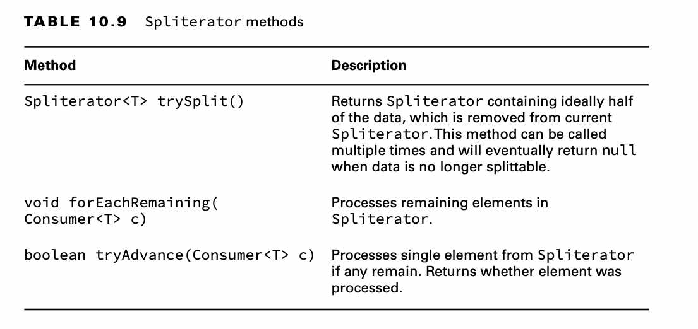

# Working with Advanced Stream Pipeline Concepts

## Linking Streams to the Underlying Data

What do you think this outputs?

    var cats = new ArrayList<String>();
    cats.add("Annie");
    cats.add("Ripley");

    var stream = cats.stream();
    cats.add("KC");
    System.out.println(stream.count());

The correct answer is 3. Remember that streams are lazily evaluated.

## Chaining Optionals

A few of the intermediate operations for streams are available for Optional.

    private static void threeDigit(Optional<Integer> optional) {
        if (optional.isPresent()) { // outer if
            var num = optional.get();
            var string = "" + num;
            if (string.length() == 3) // inner if
                System.out.println(string);
        }
    }

It works, but it contains nested if statements. That’s extra complexity. Let’s try this again with functional
programming:

    private static void threeDigitV2(Optional<Integer> optional) {
        optional.map(n -> "" + n) // part 1
                .filter(s -> s.length() == 3) // part 2 
                .ifPresent(System.out::println); // part 3
    }

Now suppose that we wanted to get an Optional<Integer> representing the length of the String contained in another
Optional. Easy enough:

    Optional<Integer> result = optional.map(String::length);

**Checked Exceptions and Functional Interfaces**

You might have noticed by now that most functional interfaces do not declare checked exceptions.This is normally okay.
However, it is a problem when working with methods that declare checked exceptions. Suppose that we have a class with a
method that throws a checked exception:

    public class ExceptionCaseStudy {
        private static List<String> create() throws IOException {
            throw new IOException();
        }
    
        public void good() throws IOException {
            ExceptionCaseStudy.create().stream().count();
        }
    
        public void bad() throws IOException {
            Supplier<List<String>> s = ExceptionCaseStudy::create; // DOES NOT COMPILE
        }
    }

Say what now?The problem is that the lambda to which this method reference expands does not declare an exception.The
Supplier interface does not allow checked exceptions. There are two approaches to get around this problem. One is to
catch the exception and turn it into an unchecked exception.

       public void ugly() {
            Supplier<List<String>> s = () -> {
                try {
                    return ExceptionCaseStudy.create();
                } catch (IOException e) {
                    throw new RuntimeException(e);
                }
            };
        }

This works. But the code is ugly. One of the benefits of functional programming is that the code is supposed to be easy
to read and concise. Another alternative is to create a wrapper method with try/catch.

    private static List<String> createSafe() {
        try {
            return ExceptionCaseStudy.create();
        } catch (IOException e) {
            throw new RuntimeException(e);
        }
    }

    public void wrapped() {
        Supplier<List<String>> s2 = ExceptionCaseStudy::createSafe;
    }

## Using a Spliterator

The characteristics of a Spliterator depend on the underlying data source. A Collection data source is a basic
Spliterator. By contrast, when using a Stream data source, the Spliterator can be parallel or even infinite. The Stream
itself is executed lazily rather than when the Spliterator is created.

You do need to know how to work with some of the common methods declared on this interface.

    var stream = List.of("bird-", "bunny-", "cat-", "dog-", "fish-", "lamb-", "mouse-");

    Spliterator<String> originalBagOfFood = stream.spliterator();
    Spliterator<String> emmasBag = originalBagOfFood.trySplit();
    emmasBag.forEachRemaining(System.out::print); // bird-bunny-cat-

    Spliterator<String> jillsBag = originalBagOfFood.trySplit();
    jillsBag.tryAdvance(System.out::print); // dog-
    jillsBag.forEachRemaining(System.out::print); // fish-
    originalBagOfFood.forEachRemaining(System.out::print); // lamb-mouse-

Now let’s try an example with a Stream. This is a complicated way to print out 123:

    var originalBag = Stream.iterate(1, n -> ++n).spliterator();

    Spliterator<Integer> newBag = originalBag.trySplit();
    newBag.tryAdvance(System.out::print); // 1
    newBag.tryAdvance(System.out::print); // 2
    newBag.tryAdvance(System.out::print); // 3

You might have noticed that this is an infinite stream. No problem! The Spliterator recognizes that the stream is
infinite and doesn’t attempt to give you half. Instead, newBag contains a large number of elements. We get the first
three since we call tryAdvance() three times. It would be a bad idea to call forEachRemaining() on an infinite stream!
Note that a Spliterator can have a number of characteristics such as CONCURRENT, ORDERED, SIZED, and SORTED. You will
only see a straightforward Spliterator on the exam. For example, our infinite stream was not SIZED.