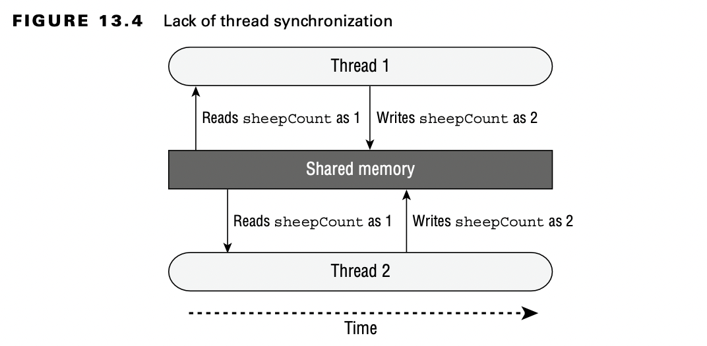
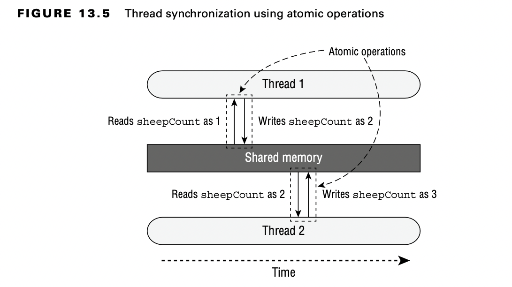

# Writing Thread-Safe Code

Thread-safety is the property of an object that guarantees safe execution by multiple threads at the same time. Since
threads run in a shared environment and memory space, how do we prevent two threads from interfering with each other? We
must organize access to data so that we don’t end up with invalid or unexpected results.

## Understanding Thread-Safety

Imagine that our zoo has a program to count sheep, preferably one that won’t put the zoo workers to sleep!

    public class SheepManager {

        private int sheepCount = 0;
        private void incrementAndReport() {
            System.out.print((++sheepCount) + " ");
        }
    
        public static void main(String[] args) {
            ExecutorService service = Executors.newFixedThreadPool(20);
            try {
                SheepManager manager = new SheepManager();
                for (int i = 0; i < 10; i++)
                    service.submit(() -> manager.incrementAndReport());
            } finally {
                service.shutdown();
            }
        }
    }

What does this program output? You might think it will output numbers from 1 to 10, in order, but that is far from
guaranteed. It may output in a different order. Worse yet, it may print some numbers twice and not print some numbers at
all! The following are possible outputs of this program:

    1 2 3 4 5 6 7 8 9 10
    1 9 8 7 3 6 6 2 4 5
    5 9 10 6 2 4 7 1 3 8 

So, what went wrong? In this example, we use the pre-increment (++) operator to update the sheepCount variable. A
problem occurs when two threads both execute the right side of the expression, reading the “old” value before either
thread writes the “new” value of the variable. The two assignments become redundant; they both assign the same new
value, with one thread overwriting the results of the other. Figure 13.4 demonstrates this problem with two threads,
assuming that sheepCount has a starting value of 1.

You can see in Figure 13.4 that both threads read and write the same values, causing one of the two ++sheepCount
operations to be lost. Therefore, the increment operator ++ is not thread-safe. As you will see later in this chapter,
the unexpected result of two tasks executing at the same time is referred to as a race condition.

## Accessing Data with volatile

The volatile keyword is used to guarantee that access to data within memory is consistent. For example, it is
possible (albeit unlikely) that our SheepManager example using ++sheepCount returns an unexpected value due to invalid
memory access while the code is executing a critical section. Conceptually, this corresponds to one of our zoo employees
tripping on the way back from the field and someone asking them the current number of sheep while they are still
trying to get up!

The volatile attribute ensures that only one thread is modifying a variable at one time and that data read among
multiple threads is consistent.

In this manner, we don’t interrupt one of our zoo workers in the middle of running. So, does volatile provide
thread-safety? Not exactly. Consider this replacement to our previous application:

    private int sheepCount = 0;
    private void incrementAndReport() {
        System.out.print((++sheepCount) + " ");
    }

Unfortunately, this code is not thread-safe and could still result in numbers being missed:

    2 6 1 7 5 3 2 9 4 8

The reason this code is not thread-safe is that ++sheepCount is still two distinct operations. Put another way, if the
increment operator represents the expression sheepCount = sheepCount + 1, then each read and write operation is
thread-safe, but the combined operation is not. Referring back to our sheep example, we don’t interrupt the employee
while running, but we could still have multiple people in the field at the same time.

In practice, volatile is rarely used. We only cover it because it has been known to show up on the exam from time to
time.

## Protecting Data with Atomic Classes

In our previous SheepManager applications, the same values were printed twice, with the highest counter being 9 instead
of 10. As we saw, the increment operator ++ is not thread-safe, even when volatile is used. It is not thread-safe
because the operation is not atomic, carrying out two tasks, read and write, that can be interrupted by other threads.

Atomic is the property of an operation to be carried out as a single unit of execution without any interference from
another thread. A thread-safe atomic version of the increment operator would perform the read and write of the variable
as a single operation, not allowing any other threads to access the variable during the operation.

In this case, any thread trying to access the sheepCount variable while an atomic operation is in process will have to
wait until the atomic operation on the variable is complete. Conceptually, this is like setting a rule for our zoo
workers that there can be only one employee in the field at a time, although they may not each report their results in
order.

Since accessing primitives and references is common in Java, the Concurrency API includes numerous useful classes in the
java.util.concurrent.atomic package.

;

    private void incrementAndReport() {
        System.out.print((sheepCount.incrementAndGet()) + " ");
    }

How does this implementation differ from our previous examples? When we run this modification, we get varying output,
such as the following:

    2 3 1 4 5 6 7 8 9 10 
    1 4 3 2 5 6 7 8 9 10 
    1 4 3 5 6 2 7 8 10 9

Unlike our previous sample output, the numbers 1 through 10 will always be printed, although the order is still not
guaranteed. Don’t worry; we address that issue shortly. The key in this section is that using the atomic classes ensures
that the data is consistent between workers and that no values are lost due to concurrent modifications.

## Improving Access with synchronized Blocks

While atomic classes are great at protecting a single variable, they aren’t particularly useful if you need to execute a
series of commands or call a method.

The most common technique is to use a monitor to synchronize access.
A monitor, also called a lock, is a structure that supports mutual exclusion, which is the property that at most one
thread is executing a particular segment of code at a given time.

In Java, any Object can be used as a monitor, along with the synchronized keyword, as shown in the following example:

    var manager = new SheepManager();
    synchronized(manager) {
        // Work to be completed by one thread at a time
    }

This example is referred to as a synchronized block. Each thread that arrives will first check if any threads are
already running the block. If the lock is not available, the thread will transition to a BLOCKED state until it can
“acquire the lock.” If the lock is available (or the thread already holds the lock), the single thread will enter the
block, preventing all other threads from entering. Once the thread finishes executing the block, it will release the
lock, allowing one of the waiting threads to proceed.

To synchronize access across multiple threads, each thread must have access to the same Object. If each thread
synchronizes on different objects, the code is not thread-safe.

    private int sheepCount = 0;
    private void incrementAndReport() {
        synchronized(this) { 
            System.out.print((++sheepCount)+" ");
        }
    }

    1 2 3 4 5 6 7 8 9 10 

Although all threads are still created and executed at the same time, they each wait at
the synchronized block for the worker to increment and report the result before entering. In this manner, each zoo
worker waits for the previous zoo worker to come back before running out on the field. While it’s random which zoo
worker will run out next, it is guaranteed that there will be at most one on the field and that the results will be
reported in order.

    private final Object herd = new Object();
    private void incrementAndReport() {
        synchronized(herd) {
            System.out.print((++sheepCount)+" ");
        }
    }

## Synchronizing on Methods

In the previous example, we established our monitor using synchronized(this) around the body of the method. Java
provides a more convenient compiler enhancement for doing so. We can add the synchronized modifier to any instance
method to synchronize automatically on the object itself. For example, the following two method definitions are
equivalent:

    void singV1() {
        synchronized(this) {
            System.out.print("La la la!");
        }
    }
    
    synchronized void singV2() {
        System.out.print("La la la!"); 
    }

The first uses a synchronized block, whereas the second uses the synchronized method modifier. Which you use is
completely up to you.

We can also apply the synchronized modifier to static methods. What object is used as the monitor when we synchronize on
a static method? The class object, of course! For example, the following two methods are equivalent for static
synchronization inside our SheepManager class:

    static void danceV1() {
        synchronized (SheepManager.class) {
            System.out.print("Time to dance!");
        }
    }

    static synchronized void danceV2() {
        System.out.print("Time to dance!");
    }

As before, the first uses a synchronized block, with the second example using the synchronized modifier. You can use
static synchronization if you need to order thread access across all instances rather than a single instance.