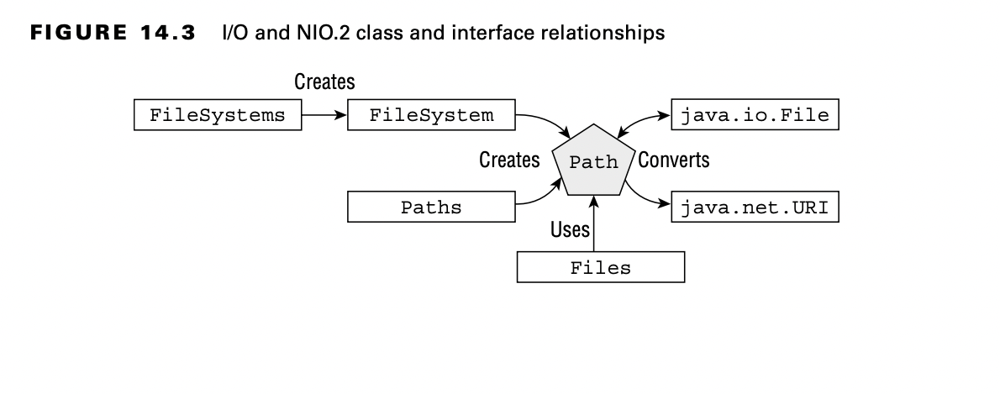
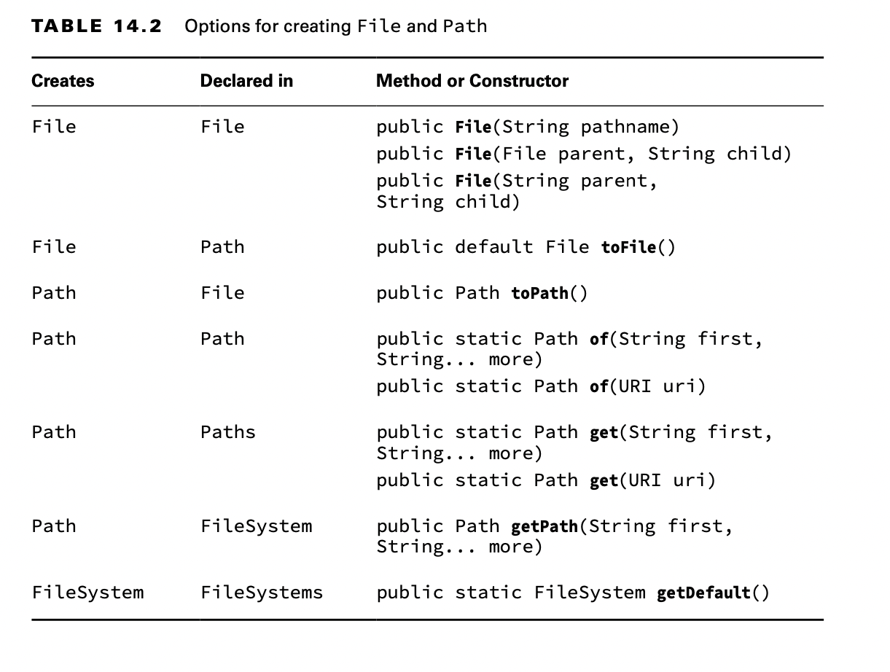

# I/O

This chapter focuses on using I/O (input/output) and NIO.2 (non-blocking I/O) APIs to interact with files and I/O
streams. The preferred approach for working with files and directories with newer software applications is to use
NIO.2 rather than I/O where possible. However, you’ll see that the two relate, and both are in wide use.

NIO stands for non-blocking input/output API and is sometimes referred to as new I/O. The exam covers NIO version 2.
There was a version 1 that covered channels, but it is not on the exam.

# Referencing Files and Directories

## Conceptualizing the File System

Data is stored on persistent storage devices, such as hard disk drives and memory cards. A file within the storage
device holds data. Files are organized into hierarchies using directories. A directory is a location that can contain
files as well as other directories.

To interact with files, we need to connect to the file system. The file system is in charge of reading and writing data
within a computer. Different operating systems use different file systems to manage their data

Next, the root directory is the topmost directory in the file system, from which all files and directories inherit. In
Windows, it is denoted with a drive letter such as C:\, while on Linux, it is denoted with a single forward slash, /.

**Operating System File Separators**

Different operating systems vary in their format of pathnames. For example, Unix-based systems use the forward slash, /,
for paths, whereas Windows-based systems use the back- slash, \, character.

    System.out.print(System.getProperty("file.separator"));

The absolute path of a file or directory is the full path from the root directory to the file or directory, including
all subdirectories that contain the file or directory. Alternatively, the relative path of a file or directory is the
path from the current working directory to the file or directory.

Determining whether a path is relative or absolute is file-system dependent. To match the exam, we adopt the following
conventions:

- If a path starts with a forward slash (/), it is absolute, with / as the root directory, such as /bird/parrot.png.
- If a path starts with a drive letter (c:), it is absolute, with the drive letter as the root directory, such as C:
  /bird/info.
- Otherwise, it is a relative path, such as bird/parrot.png.

Absolute and relative paths can contain path symbols. A path symbol is one of a reserved series of characters with
special meaning in some file systems.

A symbolic link is a special file within a file system that serves as a reference or pointer to another file or
directory. Suppose we have a symbolic link from /zoo/user/favorite to /fish/shark. The shark folder and its elements can
be accessed directly or via the symbolic link. For example, the following paths reference the same file:

    /fish/shark/swim.txt 
    /zoo/user/favorite/swim.txt

## Creating a File or Path

Using legacy I/O, this is the java.io.File class, whereas with NIO.2, it is the java.nio.file.Path interface. The File
class and Path interface cannot read or write data within a file, although they are passed as a refer- ence to other
classes,

### Creating a File

The File class is created by calling its constructor. This code shows three different constructors:

    File zooFile1 = new File("/home/tiger/data/stripes.txt");
    File zooFile2 = new File("/home/tiger", "data/stripes.txt");

    File parent = new File("/home/tiger");
    File zooFile3 = new File(parent, "data/stripes.txt");

    System.out.println(zooFile1.exists());

All three create a File object that points to the same location on disk. If we passed null as the parent to the final
constructor, it would be ignored, and the method would behave the same way as the single String constructor.

### Creating A Path

Since Path is an interface, we can’t create an instance directly. After all, interfaces don’t have constructors! Java
provides a number of classes and methods that you can use to obtain Path objects.

The simplest and most straightforward way to obtain a Path object is to use a static factory method defined on Path or
Paths. All four of these examples point to the same reference on disk:

    Path zooPath1 = Path.of("/home/tiger/data/stripes.txt");
    Path zooPath2 = Path.of("/home", "tiger", "data", "stripes.txt");

    Path zooPath3 = Paths.get("/home/tiger/data/stripes.txt");
    Path zooPath4 = Paths.get("/home", "tiger", "data", "stripes.txt");
    
    System.out.println(Files.exists(zooPath1));

Both methods allow passing a varargs parameter to pass additional path elements. The values are combined and
automatically separated by the operating system–dependent file separator. We also show the Files helper class, which can
check if the file exists on the file system.

You might notice that both the I/O and NIO.2 classes can interact with a URI. A uniform resource identifier (URI) is a
string of characters that identifies a resource. It begins with a schema that indicates the resource type, followed by a
path value such as file:// for local file systems and http://, https://, and ftp:// for remote file systems.

### Switching between File and Path

Since File and Path both reference locations on disk, it is helpful to be able to convert between them. Luckily, Java
makes this easy by providing methods to do just that:

    File file = new File("rabbit"); 
    Path nowPath = file.toPath();
    File backToFile = nowPath.toFile();

### Obtaining a Path from the FileSystems Class

NIO.2 makes extensive use of creating objects with factory classes. The FileSystems class creates instances of the
abstract FileSystem class. The latter includes methods for working with the file system directly. Both Paths.get() and
Path.of() are shortcuts for this FileSystem method.

    Path zooPath1 = FileSystems.getDefault().getPath("/home/tiger/data/stripes.txt");
    Path zooPath2 = FileSystems.getDefault().getPath("/home", "tiger", "data", "stripes.txt");

### Reviewing I/O and NIO.2 Relationships

The model for I/O is smaller, and you only need to understand the File class. In contrast, NIO.2 has more features and
makes extensive use of the factory pattern. You should become comfortable with this approach. Many of your interactions
with NIO.2 will require two types: an abstract class or interface and a factory or helper class.

In particular, keep an eye on whether the class name is singular or plural. Classes with plural names include methods to
create or operate on class/interface instances with singular names. Remember, as a convenience (and source of confusion)
, a Path can also be created from the Path interface using the static factory of() method.

The java.io.File is the I/O class, while Files is an NIO.2 helper class. Files operates on Path instances, not
java.io.File instances. We know this is confusing, but they are from completely different APIs!

