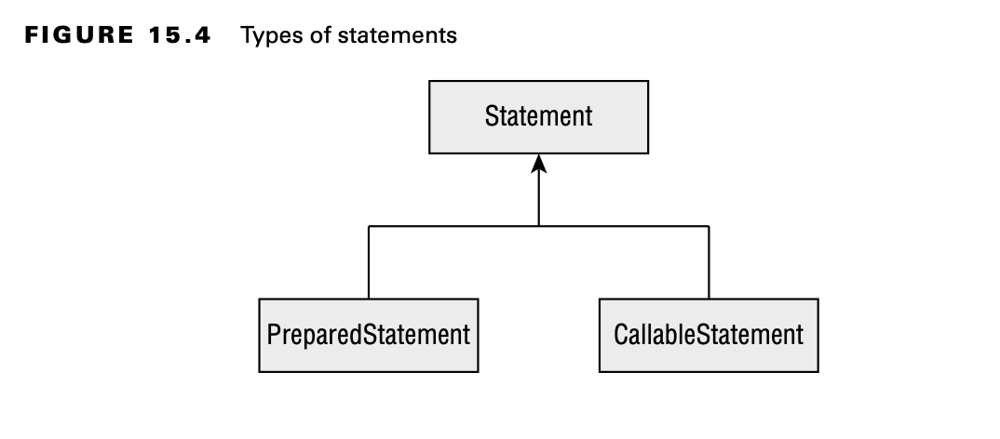
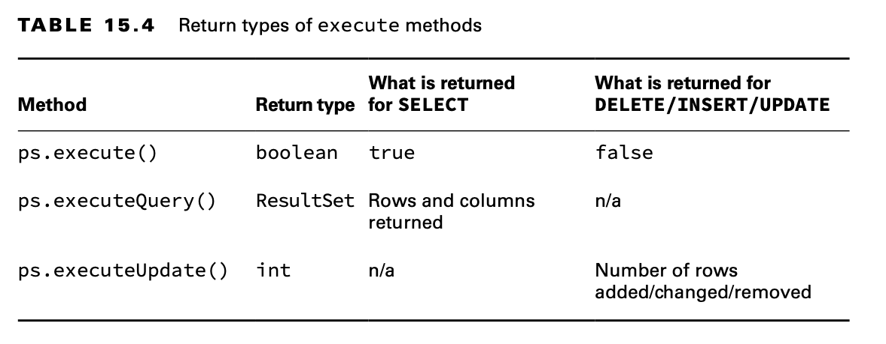

# Working with a PreparedStatement

In Java, you have a choice of working with a Statement, PreparedStatement, or CallableStatement. The latter two are
subinterfaces of Statement.

Later in the chapter, you learn about using CallableStatement for queries that are inside the database. In this section,
we look at PreparedStatement.

What about Statement, you ask? It is an interface that both PreparedStatement and CallableStatement extend. A Statement
and a PreparedStatement are similar to each other, except that a PreparedStatement takes parameters, while a Statement
does not. A Statement just executes whatever SQL query you give it.

While it is possible to run SQL directly with Statement, you shouldn’t. PreparedStatement is far superior for the
following reasons:

**Performance:**

In most programs, you run similar queries multiple times. When you use PreparedStatement, the database software often
devises a plan to run the query well and remembers it.

**Security:**

You are protected against an attack called SQL injection when using a PreparedStatement correctly.

**Readability:**

It’s nice not to have to deal with string concatenation in building a query string with lots of parameters.

**Future use:**

Even if your query is being run only once or doesn’t have any parameters, you should still use a PreparedStatement. That
way, future editors of the code won’t add a variable and have to remember to change to PreparedStatement then.

## Obtaining a PreparedStatement

To run SQL, you need to tell a PreparedStatement about it. Getting a PreparedStatement from a Connection is easy.

    try (PreparedStatement ps = conn.prepareStatement( "SELECT * FROM exhibits")) {
        // work with ps
    }

An instance of a PreparedStatement represents a SQL statement that you want to run using the Connection. It does not
execute the query yet! We get to that shortly.

Passing a SQL statement when creating the object is mandatory. You might see a trick on the exam.

    try (var ps = conn.prepareStatement()) { // DOES NOT COMPILE }

The previous example does not compile, because SQL is not supplied at the time a PreparedStatement is requested. We also
used var in this example. We write JDBC code both using var and the actual class names to get you used to both
approaches.

## Executing a PreparedStatement

Now that we have a PreparedStatement, we can run the SQL statement. The method for running SQL varies depending on what
kind of SQL statement it is. Remember that you aren’t expected to be able to read SQL, but you do need to know what the
first keyword means.

### Modifying Data with executeUpdate()

Let’s start with statements that change the data in a table. Those are SQL statements that begin with DELETE, INSERT, or
UPDATE. They typically use a method called executeUpdate(). The name is a little tricky because the SQL UPDATE statement
is not the only statement that uses this method.

    var insertSql = "INSERT INTO exhibits VALUES(10, 'Deer', 3)";
    var updateSql = "UPDATE exhibits SET name = '' " + "WHERE name = 'None'";

    var deleteSql = "DELETE FROM exhibits WHERE id = 10";

    try (var ps = conn.prepareStatement(insertSql)) { 
        int result = ps.executeUpdate(); System.out.println(result); // 1
    }

    try (var ps = conn.prepareStatement(updateSql)) { 
        int result = ps.executeUpdate(); System.out.println(result); // 0
    }

    try (var ps = conn.prepareStatement(deleteSql)) { 
        int result = ps.executeUpdate(); System.out.println(result); // 1
    }

For the exam, you don’t need to read SQL. The question will tell you how many rows are affected if you need to know.
Notice how each distinct SQL statement needs its own prepareStatement() call.

### Reading Data with executeQuery()

Next, let’s look at a SQL statement that begins with SELECT. This time, we use the executeQuery() method.

    var sql = "SELECT * FROM exhibits";
    try (var ps = conn.prepareStatement(sql);
        ResultSet rs = ps.executeQuery() ) { // work with rs
    }

Since we are running a query to get a result, the return type is ResultSet. In the next section, we show you how to
process the ResultSet.

### Processing Data with execute()

There’s a third method called execute() that can run either a query or an update. It returns a boolean so that we know
whether there is a ResultSet. That way, we can call the proper method to get more detail. The pattern looks like this:

    boolean isResultSet = ps.execute(); 
    if (isResultSet) {
        try (ResultSet rs = ps.getResultSet()) { 
        System.out.println("ran a query");
    }
    } else {
        int result = ps.getUpdateCount();
        System.out.println("ran an update"); 
    }

If the PreparedStatement refers to sql that is a SELECT, the boolean is true, and we can get the ResultSet. If it is not
a SELECT, we can get the number of rows updated.

### Using the Correct Method

What do you think happens if we use the wrong method for a SQL statement? Let’s take a look:

    var sql = "SELECT * FROM names";
    try (var ps = conn.prepareStatement(sql)) {
        var result = ps.executeUpdate(); 
    }

This throws a SQLException similar to the following:

    Exception in thread "main" java.sql.SQLException: statement does not generate a row count.

We can’t get a compiler error since the SQL is a String. We can get an exception, though, and we do. We also get a
SQLException when using executeQuery() with SQL that changes the database.

    Exception in thread "main" java.sql.SQLException: statement does not generate a result set

### Reviewing PreparedStatement Methods

To review, make sure that you know Table 15.3 and Table 15.4 well. Table 15.3 shows which SQL statements can be run by
each of the three key methods on PreparedStatement. Table 15.4 shows what is returned by each method.

