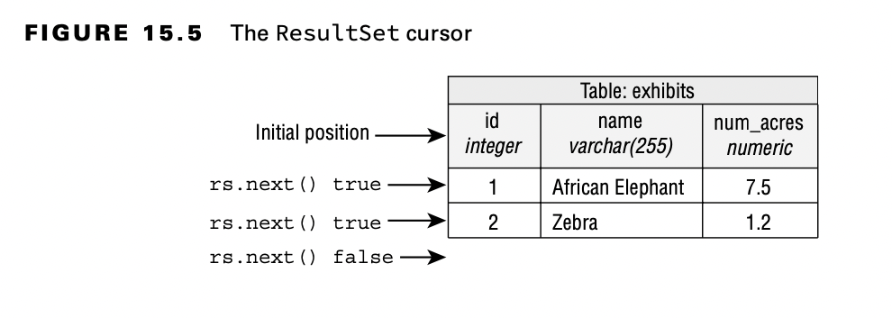
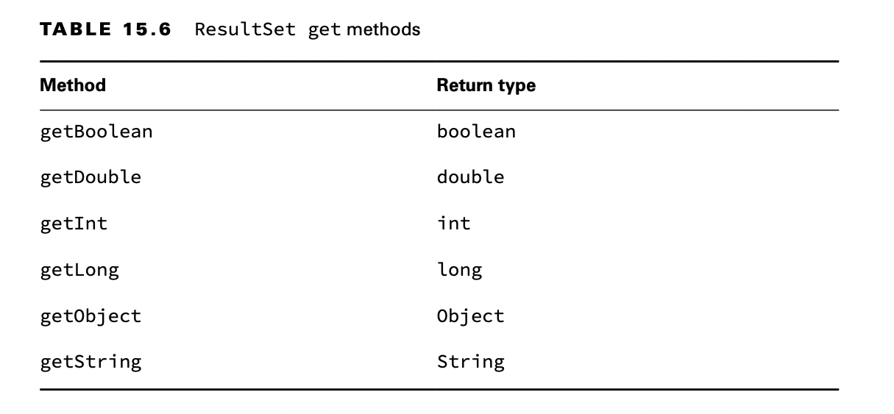

# Getting Data from A ResultSet

## Reading a ResultSet

When working with a ResultSet, most of the time, you will write a loop to look at each row. The code looks like this:

    String sql = "SELECT id, name FROM exhibits";
    var idToNameMap = new HashMap<Integer, String>();

    try (var ps = conn.prepareStatement(sql);
         ResultSet rs = ps.executeQuery()) {

        while (rs.next()) {
            int id = rs.getInt("id");
            String name = rs.getString("name");
            idToNameMap.put(id, name);
        }
        System.out.println(idToNameMap);
    }

A ResultSet has a cursor, which points to the current location in the data.

On the first loop iteration, rs.next() returns true, and the cursor moves
to point to the first row of data. On the second loop iteration, rs.next() returns true again, and the cursor moves to
point to the second row of data. The next call to rs.next() returns false. The cursor advances past the end of the data.
The false signifies that there is no more data available to get.

You can use an index, counting from 1 instead of a column name.

    int id = rs.getInt(1);
    String name = rs.getString(2);

Now you can see the column positions. Notice how the columns are counted starting with 1 rather than 0. Just like with a
PreparedStatement, JDBC starts counting at 1 in a ResultSet.

On the exam, either you will be told the names of the columns in a table, or you can assume that they are correct.
Similarly, you can assume that all SQL is correct.

Sometimes you want to get only one row from the table. Maybe you need only one piece of data. Or maybe the SQL is just
returning the number of rows in the table. When you want only one row, you use an if statement rather than a while loop.

    var sql = "SELECT count(*) FROM exhibits";
        try (var ps = conn.prepareStatement(sql); var rs = ps.executeQuery()) {
            if (rs.next()) {
                int count = rs.getInt(1);
                System.out.println(count);
            }
        }
    }

It is important to check that rs.next() returns true before trying to call a getter on the ResultSet. If a query didn’t
return any rows, it would throw a SQLException, so the if statement checks that it is safe to call. Alternatively, you
can use the column name.

    var count = rs.getInt("count");

Let’s try to read a column that does not exist.

    var sql = "SELECT count(*) AS count FROM exhibits";
    try (var ps = conn.prepareStatement(sql);
         var rs = ps.executeQuery()) {
        if (rs.next()) {
            var count = rs.getInt("total");
            System.out.println(count);
        }
    }

This throws a SQLException with a message like this:

    Exception in thread "main" java.sql.SQLException: Column not found: total

Here are a few examples to watch out for. Do you see what is wrong when no rows match?

    var sql = "SELECT * FROM exhibits where name='Not in table'";
    try (var ps = conn.prepareStatement(sql); var rs = ps.executeQuery()) {
        rs.next();
        rs.getInt(1); // SQLException 
    }

Calling rs.next() works. It returns false. However, calling a getter afterward throws a SQLException because the result
set cursor does not point to a valid position. If a match were returned, this code would have worked. Do you see what is
wrong with the following?

    var sql = "SELECT count(*) FROM exhibits";
    try (var ps = conn.prepareStatement(sql); var rs = ps.executeQuery()) {
        rs.getInt(1); // SQLException 
    }

Not calling rs.next() at all is a problem. The result set cursor is still pointing to a loca- tion before the first row,
so the getter has nothing to point to.

To sum up this section, it is important to remember the following:

- Always use an if statement or while loop when calling rs.next().
- Column indexes begin with 1.

## Getting Data for a Column

There are lots of get methods on the ResultSet interface. Table 15.6 shows the get methods that you need to know. These
are the getter equivalents of the setters in Table 15.5.

You might notice that not all of the primitive types are in Table 15.6. There are getByte() and getFloat() methods, but
you don’t need to know about them for the exam. There is no getChar() method. Luckily, you don’t need to remember this.
The exam will not try to trick you by using a get method name that doesn’t exist for JDBC. Isn’t that nice of the exam
creators?

The getObject() method can return any type. For a primitive, it uses the wrapper class. Let’s look at the following
example:

## Using Bind Variables

We’ve been creating the PreparedStatement and ResultSet in the same try-with- resources statement. This doesn’t work if
you have bind variables because they need to be set in between. Luckily, we can nest try-with-resources to handle this.
This code prints out the ID for any exhibits matching a given name:

    var sql = "SELECT id FROM exhibits WHERE name = ?";
    try (var ps = conn.prepareStatement(sql)) {
        ps.setString(1, "Zebra");
        try (var rs = ps.executeQuery()) {
            while (rs.next()) {
                int id = rs.getInt("id");
                System.out.println(id);
            }
        }
    }
