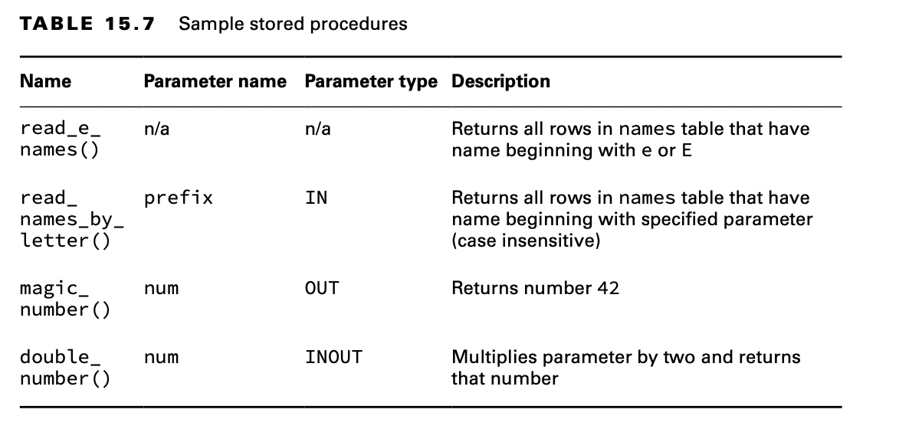
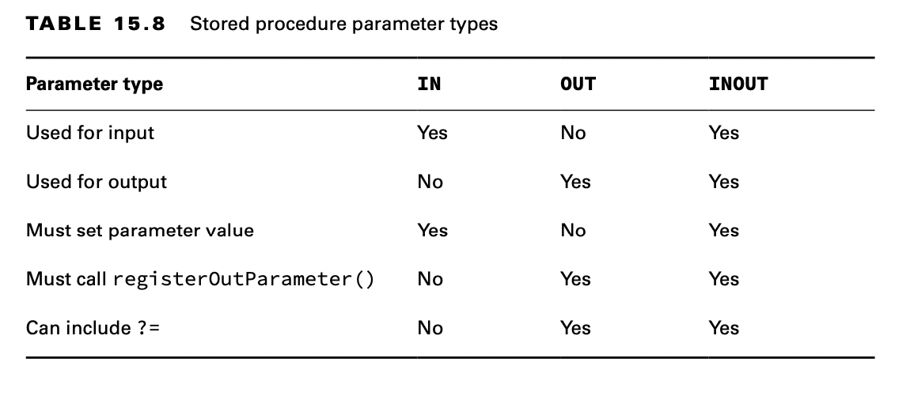

# Calling a CallableStatement

A stored procedure is code that is compiled in advance and stored in the database. Stored procedures are commonly
written in a database-specific variant of SQL, which varies among database software providers.

## Calling a Procedure without Parameters

Our read_e_names() stored procedure doesn’t take any parameters. It does return a ResultSet. Since we worked with a
ResultSet in the PreparedStatement section, here we can focus on how the stored procedure is called.

    String sql = "{call read_e_names()}";
        try (CallableStatement cs = conn.prepareCall(sql);
        ResultSet rs = cs.executeQuery()) {
        while (rs.next()) { 
            System.out.println(rs.getString(3));
        } 
    }

A stored procedure is called by putting the word call and the procedure name in braces ({}).

Creates a CallableStatement object. When we created a PreparedStatement, we used the prepareStatement() method. Here, we
use the prepareCall() method instead.

## Passing an IN Parameter

There are two differences in calling it compared to our previous stored procedure.

    var sql = "{call read_names_by_letter(?)}"; 
    try (var cs = conn.prepareCall(sql)) {
        cs.setString("prefix", "Z");
        try (var rs = cs.executeQuery()) { 
        while (rs.next()) {
            System.out.println(rs.getString(3)); }
        } 
    }

We have to pass a ? to show we have a parameter. This should be familiar from bind variables with a PreparedStatement.

We set the value of that parameter. Unlike with PreparedStatement, we can use either the parameter number (starting with
1 ) or the parameter name. That means these two statements are equivalent:

    cs.setString(1, "Z"); 
    cs.setString("prefix", "Z");

## Returning an OUT Parameter

In our previous examples, we returned a ResultSet. Some stored procedures return other information. Luckily, stored
procedures can have OUT parameters for output.

    var sql = "{?= call magic_number(?) }";

    try (var cs = conn.prepareCall(sql)) {
        cs.registerOutParameter(1, Types.INTEGER);
        cs.execute();
        System.out.println(cs.getInt("num"));
    }

we register the OUT parameter. This is important. It allows JDBC to retrieve the value on line 44. Remember to always
call registerOutParameter() for each OUT or INOUT parameter (which we cover next).

we call execute() instead of executeQuery() since we are not returning a ResultSet from our stored procedure.

**Database-Specific Behavior**

Some databases are lenient about certain things this chapter says are required. For example, some databases allow you to
omit the following:

- Braces ({})
- Bind variable (?) if it is an OUT parameter
- Call to registerOutParameter()

For the exam, you need to answer according to the full requirements, which are described in this book. For example, you
should answer exam questions as if braces are required.

## Working with an INOUT Parameter

Finally, it is possible to use the same parameter for both input and output. As you read this code, see whether you can
spot which lines are required for the IN part and which are required for the OUT part:

    var sql = "{call double_number(?)}";
    try (var cs = conn.prepareCall(sql)) {
        cs.setInt(1, 8);
        cs.registerOutParameter(1, Types.INTEGER);
        cs.execute();
        System.out.println(cs.getInt("num"));
    }

Remember that an INOUT parameter acts as both an IN parameter and an OUT parameter, so it has all the requirements of
both.

## Comparing Callable Statement Parameters

Table 15.8 reviews the different types of parameters. You need to know this well for the exam.

## Using Additional Options

So far, we’ve been creating PreparedStatement and CallableStatement with the default options. Both support ResultSet
type and concurrency options. Not all options are available on all databases. Luckily, you just have to be able to
recognize them as valid on the exam.

There are three ResultSet integer type values:

- ResultSet.TYPE_FORWARD_ONLY: Can go through the ResultSet only one row at a time
- ResultSet.TYPE_SCROLL_INSENSITIVE: Can go through the ResultSet in any order but will not see changes made to the
  underlying database table
- ResultSet.TYPE_SCROLL_SENSITIVE: Can go through the ResultSet in any order and will see changes made to the underlying
  database table

There are two ResultSet integer concurrency mode values:

- ResultSet.CONCUR_READ_ONLY: The ResultSet cannot be updated.
- ResultSet.CONCUR_UPDATABLE: The ResultSet can be updated.

These options are integer values, not enum values, which means you pass both as additional parameters after the SQL.

    conn.prepareCall(sql, ResultSet.TYPE_FORWARD_ONLY, ResultSet.CONCUR_READ_ONLY);

    conn.prepareStatement(sql, ResultSet.TYPE_SCROLL_INSENSITIVE, ResultSet.CONCUR_UPDATABLE);

If you see these options on the exam, pay attention to how they are used. Remember that type always comes first. Also,
the methods that take type also take concurrency mode, so be wary of any question that only passes one option.

